# Obiettivi e descrizione del database

Lo scopo del progetto è quello di identificare automaticamente i
complessi QRS all'interno dei tracciati del database di physionet **Long
Term AF Database** e di ricercarne gli episodi di fibrillazione atriale.

Il database include 84 registrazioni acquisite con Holter ECG di
soggetti con fibrillazione atriale parossistica oppure con fibrillazione
atriale permanente. Ad eccezione di una traccia, tutte le tracce
presentano episodi più o meno lunghi di fibrillazione atriale (da
qualche minuto alla totalità delle 24-25 ore di registrazione). Per ogni
segnale sono riportate le annotazioni inserite manualmente da esperti
clinici. I segnali sono digitalizzati a 128 Hz con una risoluzione di 12
bit in un range di 20 mV.

# Algoritmi di riconoscimento del complesso QRS

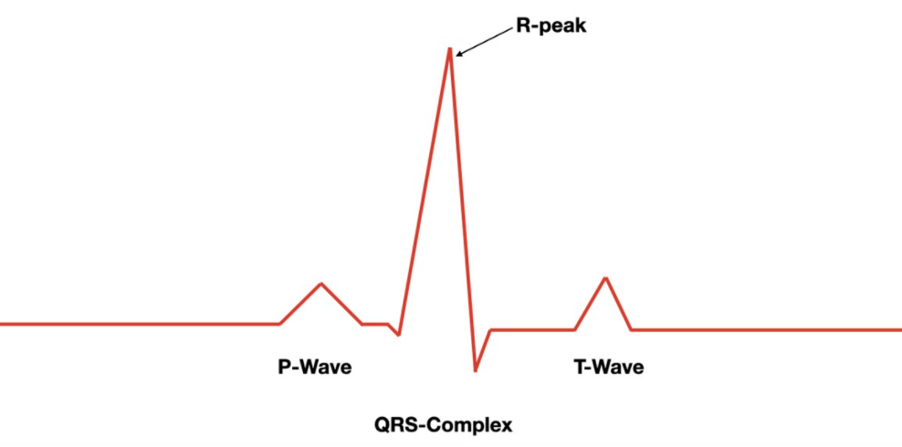

L'elettrocardiogramma è la riproduzione grafica dell'attività elettrica
del cuore registrata a livello della superficie del corpo che descrive
come il potenziale cardiaco si modifica nello svolgimento della sua
funzione. Il caratteristico tracciato ECG descrive la somma delle
depolarizzazioni e ripolarizzazioni di tutte le cellule miocardiche:

-   **Onda P**: È la prima onda che si identifica nel ciclo. Corrisponde
    alla depolarizzazione degli atri ed ha origine dal nodo
    seno-atriale; la sua durata varia tra i 60 e i 120 ms;

-   **Complesso QRS**: si tratta di un insieme di tre onde che si
    susseguono l\'una all\'altra, corrispondente alla depolarizzazione
    dei ventricoli. La durata normale dell'intero complesso è compresa
    tra 60 ms e 100 ms;

-   **Onda T**: rappresenta la prima onda della ripolarizzazione dei
    ventricoli e non è sempre identificabile in quanto può essere di
    ampiezza molto piccola.

In questo lavoro sono stati implementati quattro algoritmi di
riconoscimento del complesso QRS:

-   Fraden-Newman;

-   Template con metrica di distanza (norma L2);

-   Template con metrica di similarità (cross-correlazione
    normalizzata);

-   Algoritmo basato su decomposizione e ricostruzione DWT.

## Algoritmo di Fraden-Newman

Abbiamo scelto di implementare un algoritmo di event detection
**euristico** per la rilevazione dei complessi QRS. Infatti, in questo
caso la morfologia del complesso QRS non è rilevante ai fini dell'event
detection mentre nel caso dell'algoritmo basato su template la forma del
complesso ha impatto sulle performance dell'algoritmo.

L'algoritmo di Fraden Newman per la rilevazione del complesso QRS è un
algoritmo di tipo AF (Amplitude First Derivative). Esso si basa quindi
sull'utilizzo di informazione proveniente sia dall'ampiezza del segnale
sia dalla sua derivata prima. Nella struttura dell'algoritmo si
riconoscono i blocchi tipici di un algoritmo di event detection:

### Pre-processing

L'algoritmo mostra performance ridotte in caso di presenza di rumore a
bassa frequenza legato alla respirazione. Si è quindi reso necessario un
pre-filtraggio del segnale con un filtro IIR passa-banda di ordine 20 a
**sfasamento nullo** con banda passante tra 1 Hz e 50 Hz e attenuazione
in banda attenuata di 60 dB. A tale scopo è stata usata la funzione di
matlab *filtfilt*. Di seguito si riporta la risposta in frequenza del
filtro.

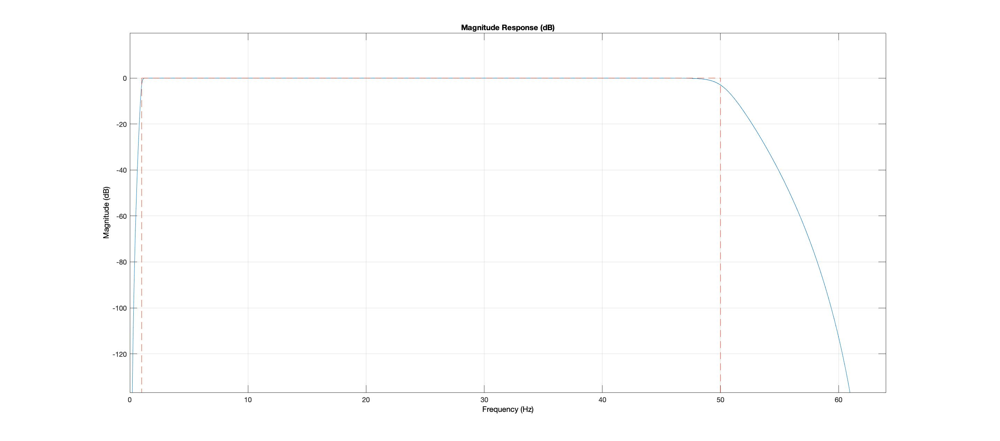

### Elaborazione

Nel blocco di elaborazione, il segnale viene manipolato al fine di
rendere evidenti gli eventi da rilevare. I passi dell'algoritmo sono i
seguenti:


soglia_{1} = th_{1}\ max\lbrack signal(n)\rbrack

$$signalRect = abs(signal)$$


$$signalClipped = \left\{ \begin{matrix}
\text{signalRect\ \ \ \ \ }\text{if}\ \ \ \ \ \ \ signalRect \geq soglia_{1} \\
\text{sogli}a_{1}\text{\ \ \ \ \ \ \ \ \ \ \ \ \ }\text{if}\ \ \ \ \ \ signalRect < soglia_{1} \\
\end{matrix} \right.\

-   si calcola la derivata prima del segnale;

-   si imposta una soglia $\text{sogli}a_{2}$ sulla derivata. Se la
    derivata supera la soglia allora c'è un evento.

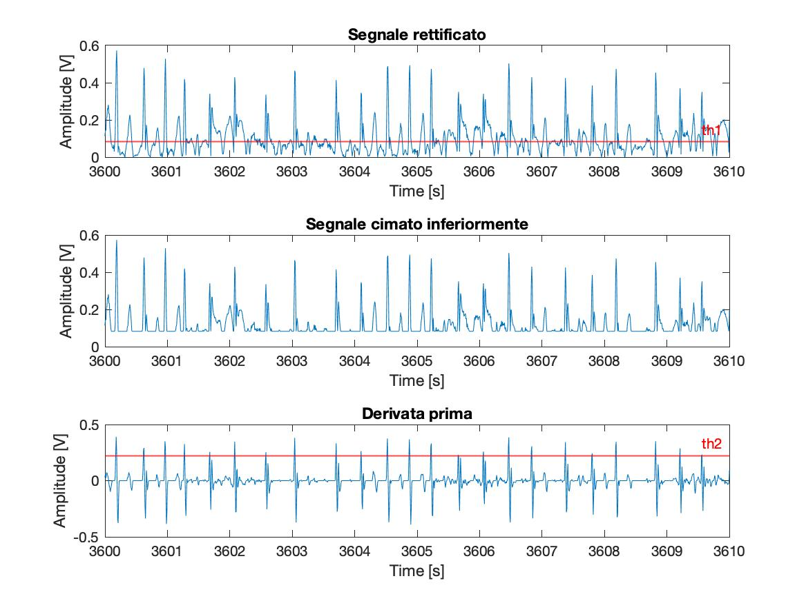{width="5.246753062117235in"
height="3.932886045494313in"}

### Decisione e ottimizzazione

L'algoritmo si basa sull'utilizzo di una soglia per il low level
clipping e di una soglia sulla derivata. Per scegliere queste soglie
sono state tracciate le curve ROC (Receiving Operating Characteristic)
al variare di entrambe le soglie al fine di ottenere dei valori
accettabili di sensibilità e specificità. Le curve ROC riportate sono
relative alla traccia 118:

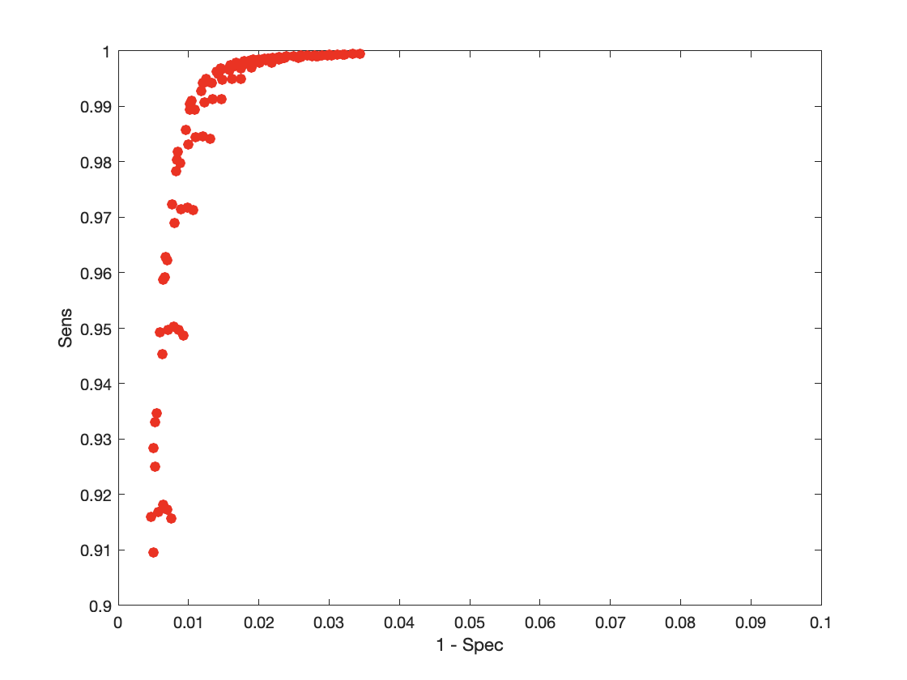

Si osserva che le soglie che garantiscono una maggiore accuratezza sono

In tal caso si ottengono, relativamente alla traccia 118:

|----------------------|----------------------|-----------------------|
| Fraden-Newman        | QRS nel gold         | Non-QRS nel gold      |
|                      | standard             | standard              |
| Traccia 118          |                      |                       |
|----------------------|----------------------|----------------------|
| QRS rilevati         | VP = 124057          | FP = 114473           |
| dall'algoritmo       |                      |                       |
|----------------------|----------------------+-----------------------|
| Non-QRS per          | FN = 1116            | VN = 10819554         |
| l'algoritmo          |                      |                       |
|----------------------|----------------------|-----------------------|

Conseguentemente si hanno i seguenti valori di sensibilità e specificità
per l'algoritmo:

$$Sens = 99.11\%$$

$$Spec = 99.04\%$$

Di seguito si riporta il grafico di sensibilità, specificità e
accuratezza ottenute per ognuna delle tracce del dataset con le soglie
calcolate in precedenza.

$$\text{Sen}s_{\text{average}} = 71,71\%$$

$$\text{Spe}c_{\text{average}} = 98,95\%$$

$$\text{Ac}c_{\text{average}} = 98,67\%$$

Si osserva che con le soglie stabilite, la sensibilità dell'algoritmo
risulta inferiore al 60% per alcune delle tracce su cui è stato
applicato. Le ragioni che abbiamo individuato relativamente a questo
fatto sono due:

1.  le **ampie oscillazioni** che si manifestano all'inizio del segnale
    filtrato che inducono ad errori circa il calcolo delle soglie;

2.  spike molto ampi nel segnale ECG che sono probabilmente **artefatti
    da movimento** degli elettrodi.

Per quanto concerne il primo problema, abbiamo osservato che le ampie
oscillazioni all'inizio del segnale filtrato sono dovute
all'implementazione della funzione di Matlab *filtfilt*. La presenza di
queste oscillazioni molto più ampie dei complessi QRS comportava un
errore nel calcolo della soglia inferiore per l'algoritmo di Fraden
Newman, andando quindi a ridurre considerevolmente la sua sensibilità.

Da alcune ricerche sulla documentazione della funzione *filtfilt*, è
emerso che questo problema è dovuto al fatto che il filtro implementato
da *filtfilt* è un **filtro marginalmente stabile**. Infatti, come
visibile nel diagramma poli/zeri, gli zeri del filtro sono molto vicini
alla circonferenza unitaria. \[3\]

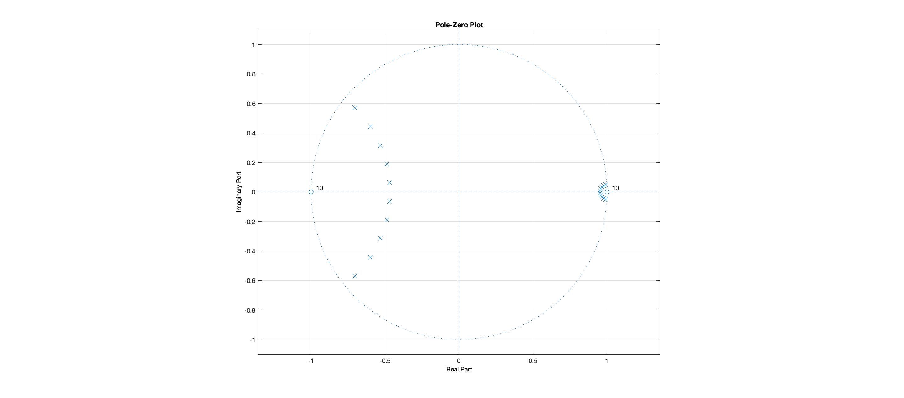

Per risolvere questo problema si è reso necessario effettuare uno **zero
padding** all'inizio e alla fine del segnale prima di filtrarlo.

Il grafico a seguire mostra i primi campioni della traccia 00 dopo il
filtraggio con *filtfilt* con e senza lo zero padding.

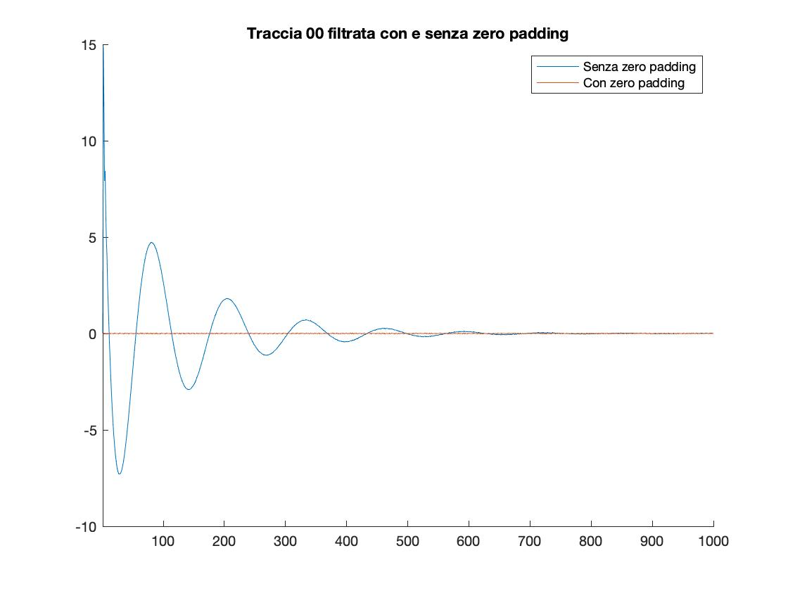{width="3.554930008748906in"
height="2.6661975065616796in"}

Con questo accorgimento il numero di tracce in cui la sensibilità
risulta inferiore al 60% è notevolmente diminuito rispetto a quanto
mostrato in precedenza.

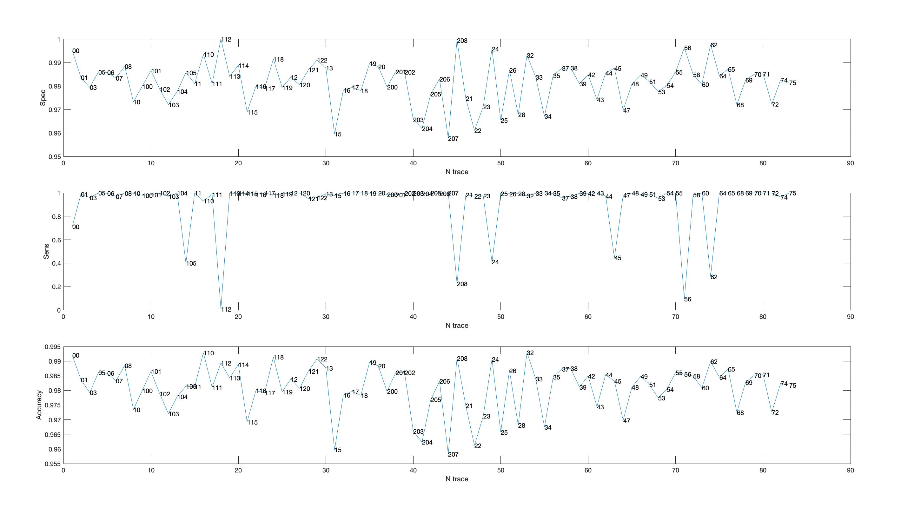{width="5.957258311461067in"
height="3.396725721784777in"}

$$\text{Sen}s_{\text{average}} = 92,48\%$$

$$\text{Spe}c_{\text{average}} = 98,16\%$$

$$\text{Ac}c_{\text{average}} = 98,11\%$$

Nelle tracce in cui la sensibilità risulta ancora inferiore al 60%
abbiamo effettivamente trovato degli artefatti da movimento degli
elettrodi che si manifestano con segnali di ampiezza molto maggiore del
livello medio del segnale, come visibile dal segmento di traccia
riportato relativo alla traccia 208:

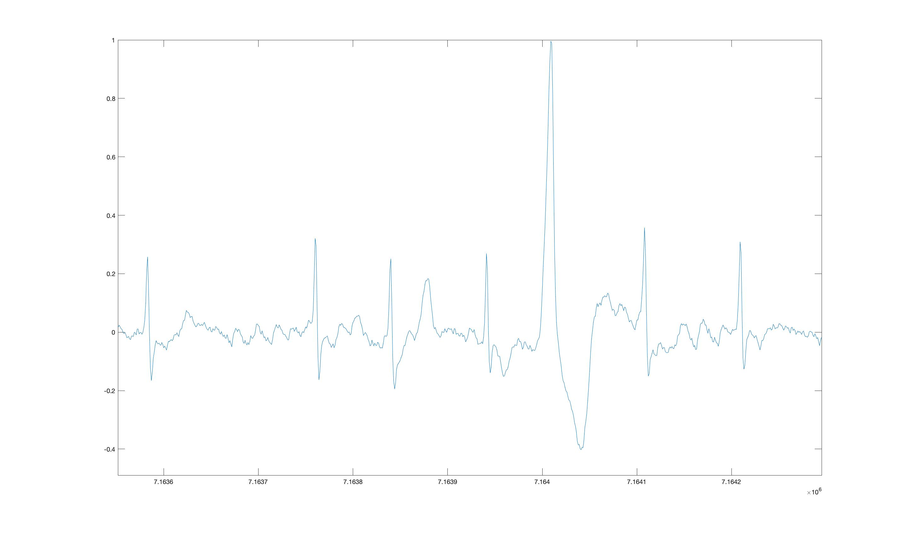{width="4.0089031058617675in"
height="2.3636373578302714in"}

Un miglioramento ulteriore delle performance dell'algoritmo si sarebbe
potuto ottenere andando a rimuovere questi artefatti, per esempio usando
dei filtri adattativi ricorsivi.

# Metodo con template

Abbiamo deciso di implementare anche un algoritmo di event detection
basato su **template**. Negli algoritmi di event detection basati su
template, l'informazione a priori sulla forma d'onda da ricercare viene
codificata all'interno di una sequenza di campioni, ovvero il
**template**, che definiscono in maniera univoca tale forma d'onda.
Abbiamo scelto di costruire il template non a partire da una singola
manifestazione della forma d'onda ma di far riferimento ad una **base di
training** formata da un certo numero di ripetizioni della forma d'onda.
Il template viene poi costruito facendo una media delle $N$ ripetizioni.

Una volta generato il template occorre ricercare la forma d'onda
codificata dal template all'interno del segnale stesso. A tale scopo
abbiamo deciso di realizzare due diversi metodi:

-   il metodo della distanza con norma L2;

-   il metodo della cross-correlazione normalizzata.

### Descrizione algoritmo di costruzione del template

Come detto, il template può essere costruito o a partire da una sola
traccia (usando *templateBuilder*) oppure da più tracce usando la
funzione *multiInputTemplateBuilder*. Queste funzioni di fatto calcolano
il template medio come media di un certo numero di forme d'onda
selezionate a partire da una traccia o dalle tracce che costituiscono la
base di training.

La funzione che va a selezionare le forme d'onda all'interno delle
tracce della base di training è *templateDataSelector*. I passi seguiti
sono i seguenti:

1.  Facendo riferimento alle **annotazioni** del gold standard, si
    scelgono $\text{nWindows}$ forme d'onda costituite da un numero di
    campioni pari a $\text{templateSize}$ da ogni traccia del training
    set. Il numero di campioni del template $\text{templateSize}$ deve
    essere **dispari** (l'algoritmo aggiusta automaticamente questo
    parametro in modo che lo sia).

2.  I campioni finestrati del segnale vengono centrati attorno
    all'annotazione del medico per cui l'operazione di **allineamento**
    e di **adattamento** della durata delle forme d'onda viene
    implementata in modo automatico perché il **punto fiduciario è il
    baricentro della finestra** e la durata è esattamente
    $\text{templateSize}$ per ogni forma d'onda del training set;

3.  Per essere certi che l'allineamento sia corretto sempre, anche in
    presenza di piccoli errori nelle annotazioni del gold standard,
    l'algoritmo controlla che il **campione centrale i**n ciascuna
    finestra sia effettivamente il **valore massimo**. Nel caso in cui
    non lo sia si effettua una **traslazione** a destra o a sinistra.

4.  La funzione ritorna una matrice contenente sulle righe i campioni di
    ogni forma d'onda selezionata a cui viene rimosso il valor medio per
    averlo a media nulla.

## Metodo della distanza con norma L2

In questo metodo si usa una **metrica di distanza** tra segnale e
template definita dalla norma L2:

$$L2(i) = \frac{1}{D}{\sum_{k = 0}^{N - 1}\left| x(i + k) - TMP(k) \right|}^{2}$$

con $D$ il numero di campioni del template e $N$ il numero di campioni
del segnale. L'evento si trova in corrispondenza della minima distanza
tra segnale e template (ovvero in corrispondenza della massima
somiglianza).

### Descrizione dell'algoritmo

I passi dell'algoritmo sono i seguenti:

1.  si filtra il segnale con un filtro passa-banda tra 1 e 50 Hz (si fa
    anche un filtraggio a media mobile);

2.  si costruisce il template equalizzato al massimo e allineato sui
    picchi utilizzando la funzione *templateDataSelector* per
    selezionare le forme d'onda e *multiInputTemplateBuilder* per
    costruire il template come media;

3.  si costruisce la norma L2 con la funzione *templateL2Norm* che
    calcola la norma L2;

4.  si identifica un evento quando i minimi locali della norma L2
    risultano inferiori ad una certa soglia $\text{th}$ (abbiamo usato
    *findpeaks*).

Sia segnale che template sono normalizzati al massimo.

### Ottimizzazione

Abbiamo ottimizzato i parametri dell'algoritmo, ovvero la dimensione del
template e la soglia, a partire da un template costruito su 200 forme
d'onda della traccia 118 e testato sulla traccia 118 stessa (training e
testing set appartengono alla stessa forma d'onda).

La curva ROC risultante è riportata di seguito:

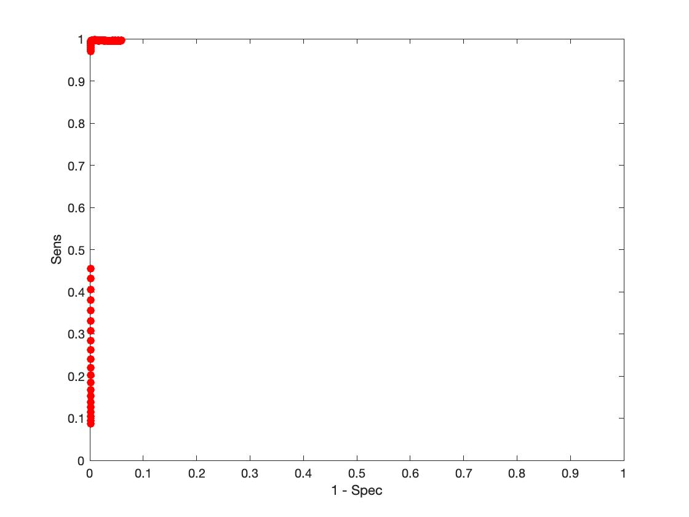

Si trova che i valori ottimi di dimensione del template e della soglia
sono:

$$templateSize = 7\ campioni$$

$$threshold = - 0.495$$

Con questi parametri si raggiungono i seguenti valori di specificità,
accuratezza e sensibilità sulla traccia 118 sono:

$$Sens = 99,64\%$$

$$Spec = 99,74\%$$

$$Acc = 99,74\%$$

Abbiamo quindi applicato l'algoritmo a tutte le tracce ottenendo i
seguenti risultati:

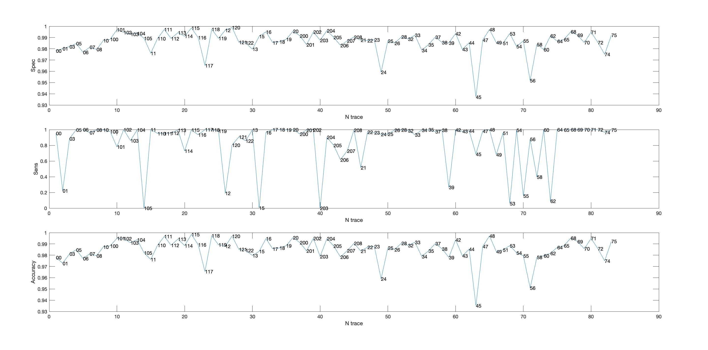

$$\text{Sen}s_{\text{average}} = 84,43\%$$

$$\text{Spe}c_{\text{average}} = 98,65\%$$

$$\text{Ac}c_{\text{average}} = 98,52\%$$

Come si vede i risultati relativamente alla sensibilità non sono ottimi.
Su alcune tracce, in particolare la 105 e la 203, la sensibilità nulla
non è dovuta all'algoritmo ma al fatto che si tratta di una derivazione
ECG differente dalle altre per cui la forma del template è completamente
diversa dai complessi QRS di queste tracce.

Abbiamo pensato di effettuare un **filtraggio a media** **mobile** sul
segnale per rimuovere eventuali fluttuazioni residue della linea di base
(nonostante il prefiltraggio passa-banda). Abbiamo quindi rieffettuato
il calcolo dei parametri ottimi tracciando le curve ROC al variare dei
parametri con il template costruito a partire dalla traccia 118 e
testando l'algoritmo sulla traccia 118 stessa. I risultati ottenuti sono
riportati di seguito:

$$templateSize = 9\ campioni$$

$$threshold = - 0,1$$

$$Sens = 99,38\%$$

$$Spec = 99,76\%$$

$$Acc = 97,76\%$$

Con questi nuovi parametri, i risultati su tutte le tracce sono i
seguenti:

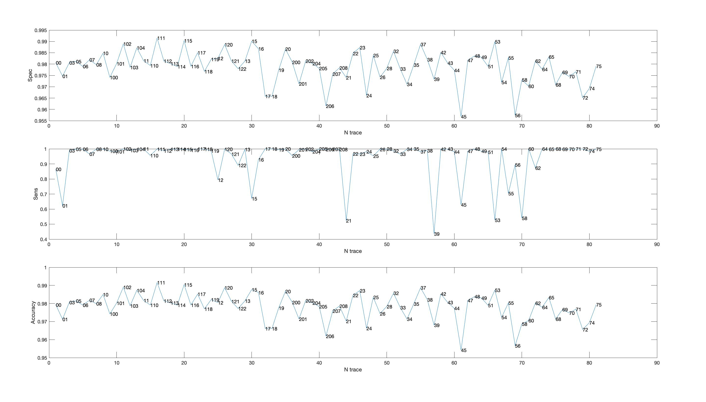

$$\text{Sen}s_{\text{average}} = 94,17\%$$

$$\text{Spe}c_{\text{average}} = 97,88\%$$

$$\text{Ac}c_{\text{average}} = 97,85\%$$

Abbiamo infine provato a costruire il template a partire da un certo
numero di forme d'onda prelevate da più tracce del training set (118,
102, 115, 120, 45). Abbiamo quindi applicato l'algoritmo ad un certo
numero di forme d'onda (testing set: 00, 01, 03, 05, 06, 07, 08, 10,
100, 101, 102, 103, 104, 11, 110, 111) compatibilmente con i **tempi di
esecuzione** al fine di individuare nuovamente i parametri che
massimizzassero le performance dell'algoritmo. I risultati sono
riportati di seguito:

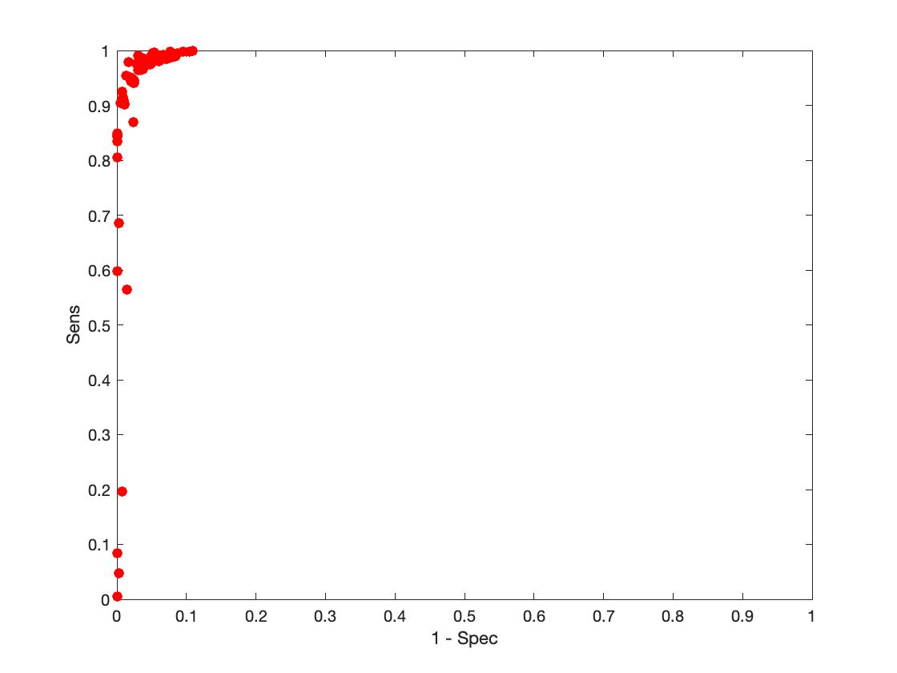

$$templateSize = 7\ campioni$$

$$threshold = - 0.2$$

Applicando l'algoritmo a tutte le tracce con i parametri riportati sopra
si ottengono i seguenti risultati:

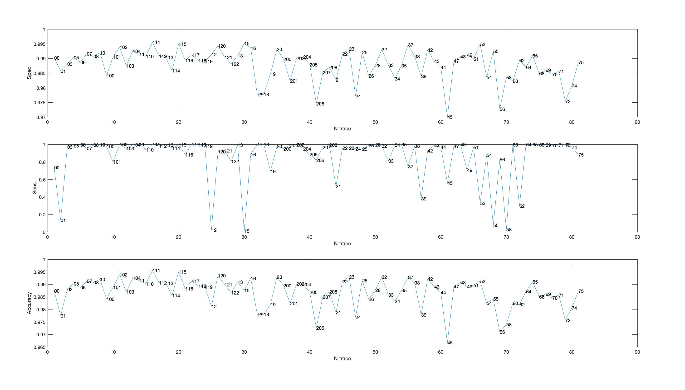

$$\text{Sen}s_{\text{average}} = 85,98\%$$

$$\text{Spe}c_{\text{average}} = 98,79\%$$

$$\text{Ac}c_{\text{average}} = 98,68\%$$

Pertanto, in questo caso, le performance migliori si ottenevano usando
un template costruito a partire da una sola traccia con soglia
$threshold = - 0.1$ e una dimensione del template di 9 campioni.

Non si può escludere che un training set diverso da quello utilizzato da
noi, magari formato da più tracce, potesse fornire risultati migliori.
Abbiamo potuto constatare come nelle tracce in cui la sensibilità è
molto bassa siano presenti molti **battiti ventricolari**, i quali
presentano una forma diversa rispetto a quelli sinusali. Una possibile
soluzione potrebbe essere quindi quella di costruire un template anche
per questi tipi di battiti.

## Metodo della cross-correlazione normalizzata

Nel metodo della **cross-correlazione normalizzata** si usa una
**metrica di similitudine** tra segnale e template definita dall'indice
di correlazione lineare $\gamma_{\text{TMPx}}(k)$ espresso dalla
seguente:

$$\gamma_{\text{TMPx}}(k) = \frac{{\widehat{c}}_{\text{TMPx}}}{\sigma_{\text{TMP}}\sigma_{x}(k)} = \frac{1}{D - 1}\frac{\sum_{i = 1}^{D}\left( \text{TMP}(i) - \overline{\text{TMP}} \right)\left( x(i + k) - \overline{x}(k) \right)}{\sqrt{{\sum_{i = 1}^{D}\left( \text{TMP}(i) - \overline{\text{TMP}} \right)}^{2}\sum_{i = 1}^{D}\left( x(i + k) - \overline{x}(k) \right)^{2}}}$$

$x$ è il segnale e $\text{TMP}$ il template.  $\overline{\text{TMP}}$ è
il valor medio del template mentre $\overline{x}(k)$ è il valor medio
del segnale che viene calcolato in ogni finestra di $D$ campioni, dove
$D$ è la durata del template. La sottrazione di $\overline{x}(k)$
equivale ad una rimozione della linea di base attraverso una media
mobile di $D$ campioni. La divisione per la deviazione standard del
segnale calcolata su ogni finestra di $D$ campioni rappresenta invece
una equalizzazione. L'indice di correlazione lineare assume valori
compresi tra 1 e -1 dove 1 indica la massima somiglianza e -1 la
perfetta opposizione.

L'evento viene rilevato quando l'indice di correlazione supera una certa
soglia.

### Descrizione dell'algoritmo

I passi dell'algoritmo sono i seguenti:

1.  si costruisce il template allineato al punto fiduciario (il massimo)
    utilizzando la funzione *templateDataSelector* per selezionare le
    forme d'onda e *multiInputTemplateBuilder* per costruire il template
    come media;

2.  si calcola la funzione di cross-correlazione normalizzata con la
    funzione *crosscorrelazione*;

3.  si effettua una ricerca di massimi con la funzione *findpeaks*. Si
    identifica un evento al superamento della soglia $\text{threshold}$.

Nella proposta finale dell'algoritmo sia segnale che template sono stati
filtrati con il filtro passa-banda tra 1 e 50 Hz.

### Ottimizzazione

Costruiamo il template sulla traccia 118 e lo testiamo sulla traccia 118
(testing set e training set appartengono alla stessa traccia). I grafici
a seguire sono relativi ad un template costruito con 200 forme d'onda
della traccia 118 ognuna di dimensioni 11 campioni partendo dal
1000esimo campione.

Non ci sono apprezzabili differenze tra il template costruito con il
segnale non filtrato e quello costruito con il segnale filtrato. Ciò è
probabilmente dovuto all'implementazione dell'indice di
cross-correlazione normalizzata, in cui andiamo a sottrarre il valor
medio del segnale in ciascuna finestra di $D$ campioni. Questo equivale
ad un filtraggio a media mobile che elimina la linea di base.

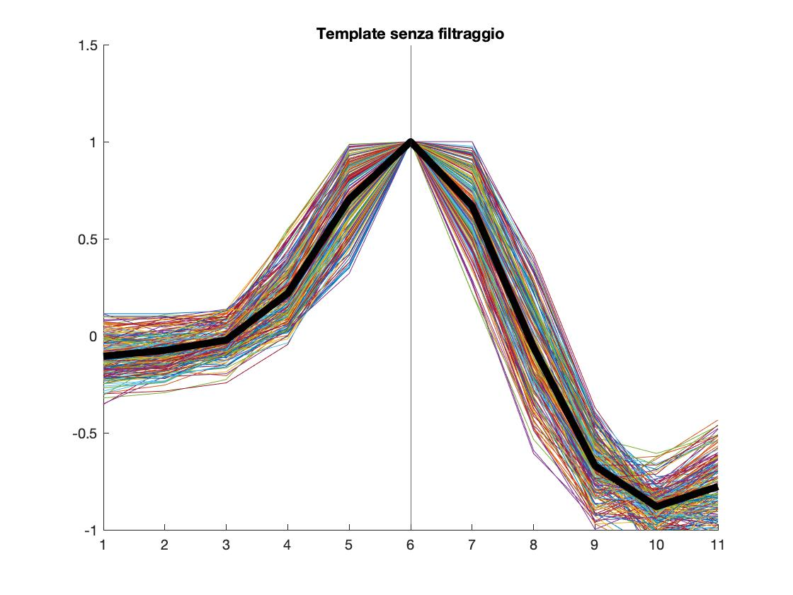

Testando l'algoritmo sulla traccia 118 con una soglia sulla
crosscorrelazione normalizzata di 0.9 si ottiene la seguente tabella di
contingenza relativi al caso senza filtraggio:

+----------------------+----------------------+-----------------------+
| $$\mathbf            | QRS nel gold         | Non-QRS nel gold      |
| {\text{metodo\ γ}}$$ | standard             | standard              |
|                      |                      |                       |
| Senza filtraggio     |                      |                       |
|                      |                      |                       |
| Soglia 0.9           |                      |                       |
|                      |                      |                       |
| $$\mathbf{D = 11}$$  |                      |                       |
+======================+======================+=======================+
| QRS rilevati         | VP = 124580          | FP = 90249            |
| dall'algoritmo con   |                      |                       |
| template             |                      |                       |
+----------------------+----------------------+-----------------------+
| Non-QRS per          | FN = 593             | VN = 10843778         |
| l'algoritmo con      |                      |                       |
| template             |                      |                       |
+----------------------+----------------------+-----------------------+

$$Sens = 99,53\%$$

$$Spec = 99,17\%$$

$$Accuratezza = 99,18\%$$

Testando l'algoritmo sulla traccia 118 si ottiene la seguente tabella di
contingenza relativi al caso con filtraggio:

+----------------------+----------------------+-----------------------+
| $$\mathbf            | QRS nel gold         | Non-QRS nel gold      |
| {\text{metodo\ γ}}$$ | standard             | standard              |
|                      |                      |                       |
| con filtraggio       |                      |                       |
|                      |                      |                       |
| soglia 0.9           |                      |                       |
|                      |                      |                       |
| $$\mathbf{D = 11}$$  |                      |                       |
+======================+======================+=======================+
| QRS rilevati         | VP = 124793          | FP = 110694           |
| dall'algoritmo con   |                      |                       |
| template             |                      |                       |
+----------------------+----------------------+-----------------------+
| Non-QRS per          | FN = 380             | VN = 10823333         |
| l'algoritmo con      |                      |                       |
| template             |                      |                       |
+----------------------+----------------------+-----------------------+

$$Sens = 98,99\%$$

$$Spec = 98,99\%$$

$$Accuratezza = 99,00\%$$

Si osserva che il filtraggio produce un peggioramento delle prestazioni.

Si osserva l'elevata quantità di falsi positivi come anche visibile dal
grafico sottostante:

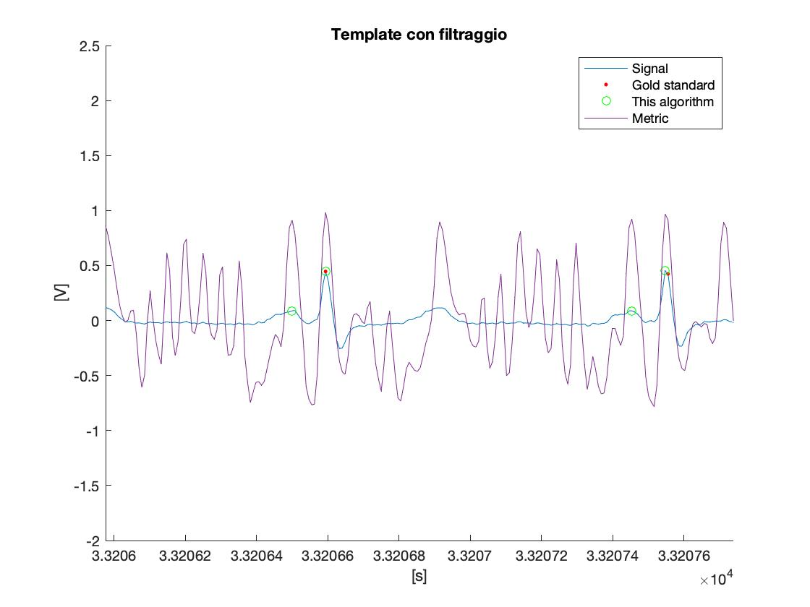

Abbiamo cercato quindi di migliorare le prestazioni effettuando degli
aggiustamenti. Abbiamo fatto variare il numero di campioni nel template
da 5 campioni, corrispondenti ad una durata del complesso QRS di 50 ms a
21 campioni, corrispondenti ad una durata di 150 ms.

La soglia sulla crosscorrelazione normalizzata è stata fatta variare da
0.6 a 0.95 in 11 iterazioni.

A seguire si riporta la curva ROC relativamente al caso non filtrato.

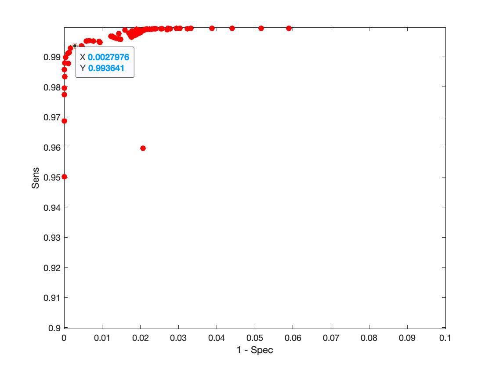

Dalla curva risulta che la soglia ottima sulla correlazione è di 0.845
mentre il numero di campioni ottimo per il template è di 17 campioni.

$$D = 17\ samples,\ \ \ th = 0.845$$

Con questi valori dei parametri si ottiene la seguente tabella di
contingenza

+----------------------+----------------------+-----------------------+
| $$\mathbf            | QRS nel gold         | Non-QRS nel gold      |
| {\text{metodo\ γ}}$$ | standard             | standard              |
|                      |                      |                       |
| senza filtraggio     |                      |                       |
|                      |                      |                       |
| soglia 0.845         |                      |                       |
|                      |                      |                       |
| $$\mathbf{D = 17}$$  |                      |                       |
+======================+======================+=======================+
| QRS rilevati         | VP = 124377          | FP = 30589            |
| dall'algoritmo con   |                      |                       |
| template             |                      |                       |
+----------------------+----------------------+-----------------------+
| Non-QRS per          | FN = 796             | VN = 10903438         |
| l'algoritmo con      |                      |                       |
| template             |                      |                       |
+----------------------+----------------------+-----------------------+

$$Sens = 99,36\%$$

$$Spec = 99,72\%$$

$$Accuratezza = 99,72\%$$

Si osserva dunque un miglioramento delle prestazioni soprattutto per
quanto riguarda il numero dei falsi positivi.

A seguire si riporta la curva ROC relativamente al caso con segnale e
template filtrati:

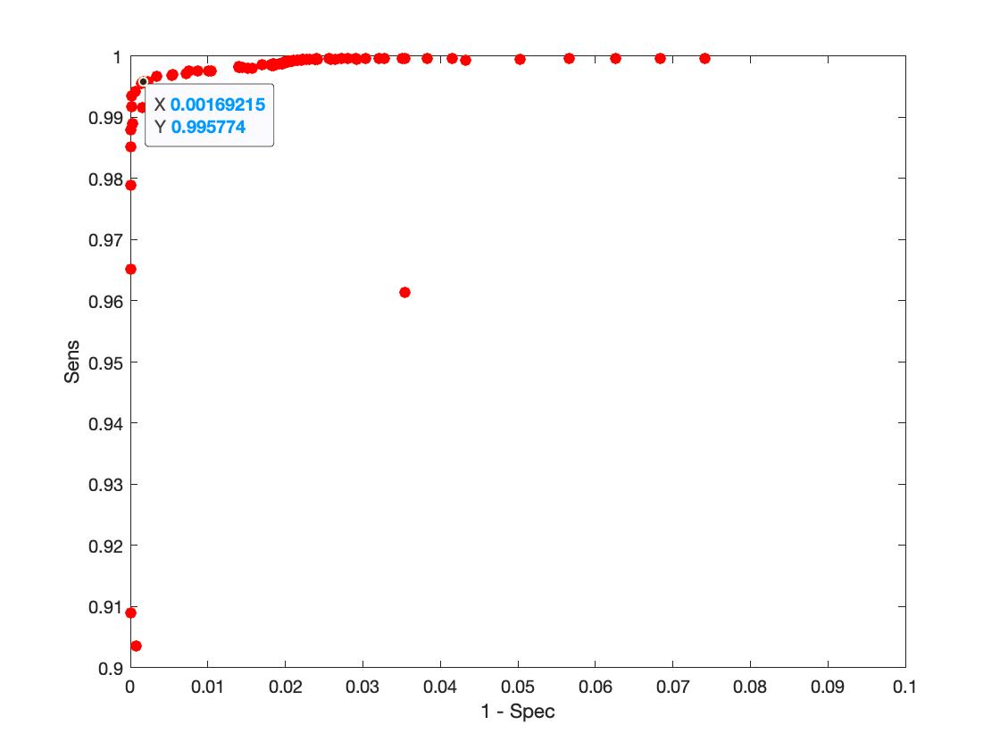

Dalla curva risulta che la soglia ottima sulla correlazione è di 0.74
mentre il numero di campioni ottimo per il template è di 25 campioni.

+----------------------+----------------------+-----------------------+
| $$\mathbf            | QRS nel gold         | Non-QRS nel gold      |
| {\text{metodo\ γ}}$$ | standard             | standard              |
|                      |                      |                       |
| con filtraggio       |                      |                       |
|                      |                      |                       |
| soglia 0.74          |                      |                       |
|                      |                      |                       |
| $\mathbf{D =}        |                      |                       |
| $`<!-- -->`{=html}25 |                      |                       |
+======================+======================+=======================+
| QRS rilevati         | VP = 124672          | FP = 14500            |
| dall'algoritmo con   |                      |                       |
| template             |                      |                       |
+----------------------+----------------------+-----------------------+
| Non-QRS per          | FN = 501             | VN = 10919527         |
| l'algoritmo con      |                      |                       |
| template             |                      |                       |
+----------------------+----------------------+-----------------------+

$$Sens = 99,60\%$$

$$Spec = 99,87\%$$

$$Accuratezza = 99,86\%$$

Questi risultati sono relativi ad un training set e un testing set
prelevati dalla stessa traccia.

Abbiamo quindi testato l'algoritmo con i parametri ottimizzati su tutte
le tracce. Il grafico riporta i risultati:

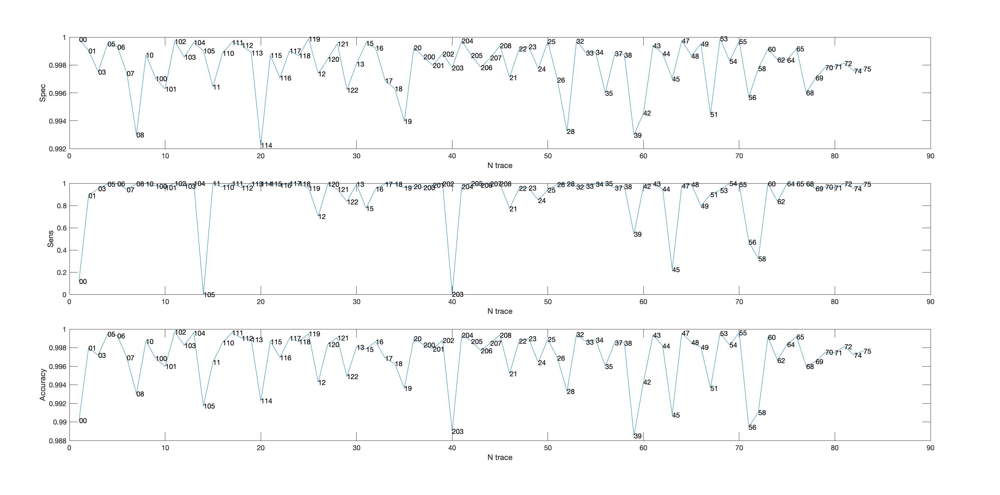

$$\text{Sen}s_{\text{average}} = 91,99\%$$

$$\text{Spe}c_{\text{average}} = 99,79\%$$

$$\text{Ac}c_{\text{average}} = 99,70\%$$

Si osserva che per alcune tracce la sensibilità assume valori molto
bassi, indice del fatto che il numero di falsi negativi è molto alto.
Osservando la traccia 105 si vede che la derivazione usata è diversa e
quindi i complessi QRS risultano ribaltati. Questo spiega l'incapacità
dell'algoritmo di rilevare gli eventi.

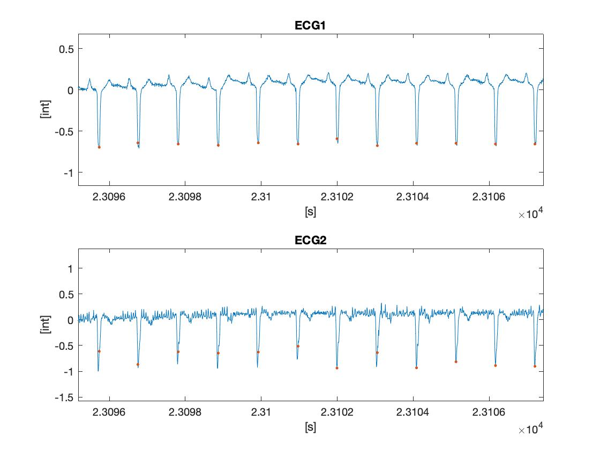

Lo stesso è visibile per la 203:

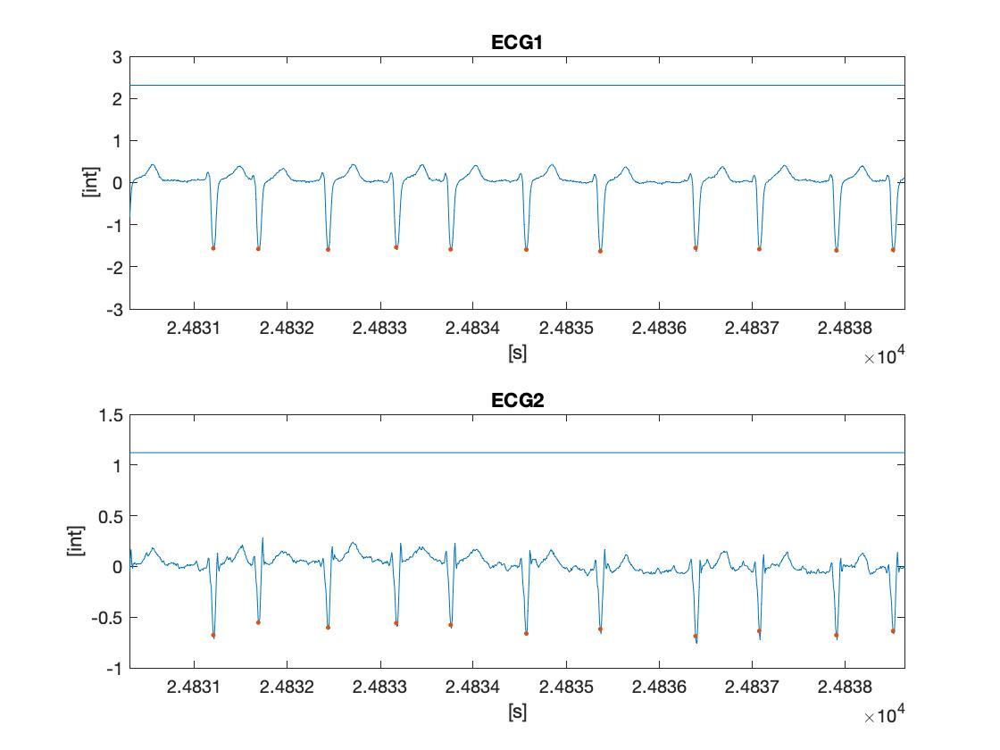

Abbiamo infine effettuato una simulazione utilizzando un template
costruito con 50 forme d'onda prelevate da 5 tracce (118, 102, 115, 120,
45). Abbiamo quindi ottimizzato i parametri su un training set di 11
forme d'onda (00, 01, 03, 05, 06, 07, 08, 10, 100, 101, 102) per motivi
di tempi di esecuzione. La curva ROC è riportata di seguito:

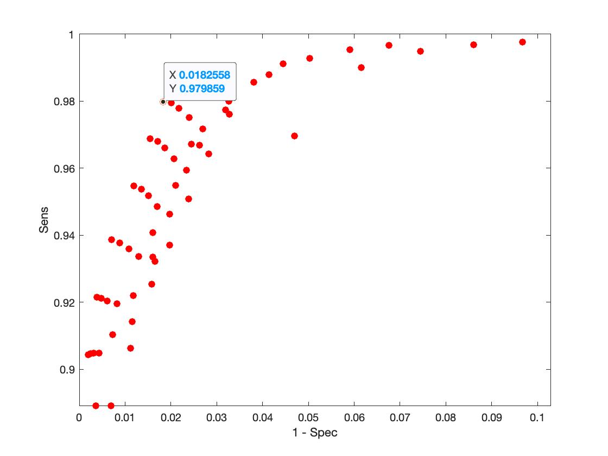

Si trova che i parametri ottimi sono:

$$templateSize = 21\ campioni$$

$$threshold = 0,55$$

Applicando l'algoritmo con i parametri ottimizzati su tutte le tracce si
ottiene:

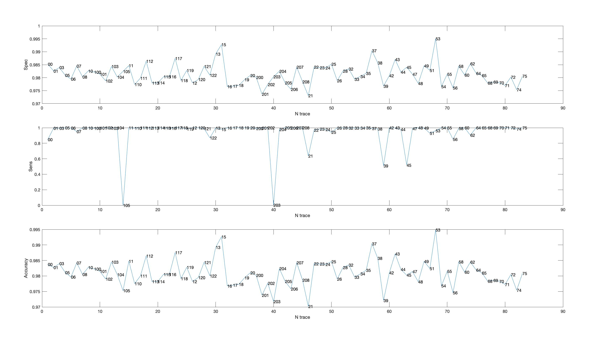

$$\text{Sen}s_{\text{average}} = 94,72\%$$

$$\text{Spe}c_{\text{average}} = 98,13\%$$

$$\text{Ac}c_{\text{average}} = 98,10\%$$

#  Algoritmo con DWT

È stato infine implementato un algoritmo di riconoscimento del complesso
QRS basato sull'utilizzo della trasformata wavelet.

## Trasformata Wavelet

La trasformata wavelet è una rappresentazione tempo-frequenza o meglio
tempo-scala di tipo lineare. Essa è pensabile come il prodotto scalare
tra il segnale $x(t)$ e la funzione della base $\psi_{\text{τs}}(t)$:

$$\text{CWT}(\tau,s) = \int x(t)\psi_{\text{τs}}^{*}(t)dt$$

con

$$\psi_{\text{τs}}(t) = \frac{1}{\sqrt{|s|}}\psi\left( \frac{t - \tau}{s} \right)$$

$\psi(t)$ è detta wavelet madre perché da essa si ottengono tutte le
funzioni della base wavelet per traslazione e cambiamento di scala (le
wavelet figlie sono versioni traslate e dilatate della wavelet madre).

Una wavelet, come dice il suo nome, è una "piccola onda" dove per
piccola si intende che è a supporto compatto, mentre per onda si indica
la sua natura oscillatoria (è a valor medio nullo per garantire
l'invertibilità). La wavelet è caratterizzata da due parametri: il
**parametro di traslazione temporale** $\mathbf{\tau}$, che definisce
dove essa è posizionata nel tempo, e il **parametro di scala**
$\mathbf{s}$, che definisce come la wavelet viene dilatata o compressa.

La scala è l'inverso della frequenza. Aumentando la scala, la wavelet
risulta dilatata e quindi cattura informazione a più bassa frequenza. Al
contrario, diminuendo la scala, la wavelet risulta compressa e quindi
fornirà informazione relativamente a frequenze più alte.

L'idea alla base è quella di calcolare quanto il segnale e la wavelet ad
una particolare scala e posizione nel tempo sono tra loro simili, dove
tale similarità è da intendersi nel **contenuto frequenziale**.

Nella pratica, quello che si va a fare è un prodotto scalare tra il
segnale e la wavelet ad una certa scala e poi si trasla la wavelet nel
tempo al fine di coprire tutta la durata del segnale. Si ripete lo
stesso procedimento relativamente ad una scala diversa. I coefficienti
wavelet "raccontano" quanto il segnale e la wavelet risultano simili ad
una corrente scala: se il segnale ha un contenuto frequenziale
corrispondente alla scala corrente, allora la wavelet alla scala
corrente sarà simile al segnale nella porzione temporale $\tau$ in cui è
presente quella componente frequenziale e quindi il coefficiente CWT nel
punto $(\tau,s)$ sarà grande.

È possibile implementare la CWT in modo molto efficace, veloce e
nativamente digitale usando la DWT. L'idea alla base della DWT è quella
di ottenere una rappresentazione tempo-scala di un segnale digitale
tramite tecniche di **filtraggio digitale**. La DWT, infatti, si può
ottenere facendo passare il segnale attraverso un banco di filtri: ad
ogni livello, il segnale viene filtrato con un filtro passa-alto per
analizzare le alte frequenze e con un filtro passa-basso per analizzare
le basse frequenze. I filtri passa-basso sono detti **funzioni di
scalatura** mentre i filtri passa-alto **funzioni wavelet**.

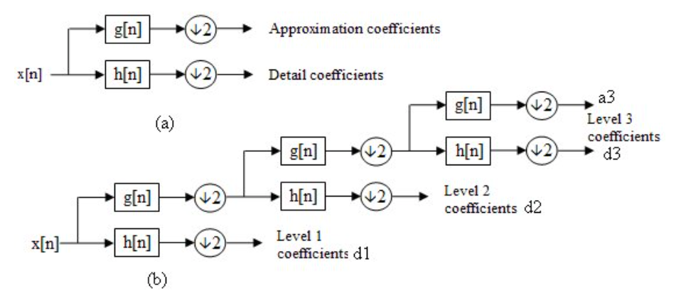

Lo schema riassume la logica del filtraggio. In ogni livello, gli $N$
campioni del segnale vengono filtrati attraverso dei filtri ortogonali
con medesima frequenza di taglio. Le uscite di entrambi i filtri vengono
decimate: quella del passa-alto va a costituire gli $N/2^{i}$
coefficienti DWT di livello $i - esimo$ mentre l'uscita del passa-basso
viene applicata ad un successivo livello di filtraggio.

La DWT analizza quindi il segnale a diverse bande frequenziali con
risoluzioni diverse decomponendo ad ogni livello di filtraggio in due
componenti:

-   una approssimazione grezza o *coarse*, che è l'uscita del
    passa-basso;

-   una informazione di dettaglio, che è l'uscita del passa-alto.

Ad ogni livello la risoluzione nel tempo dimezza perché viene effettuato
un sotto-campionamento (la banda viene dimezzata quindi è possibile
sotto-campionare) mentre la risoluzione in frequenza raddoppia (la banda
dimezza, quindi raddoppia la scala, cioè ci spostiamo verso più basse
frequenze).

Utilizzando una DWT non decimata, è possibile ricostruire il segnale
come somma dell'approssimazione di livello più alto e dei dettagli di
tutti i livelli. Questo fatto può essere sfruttato per effettuare un
**filtraggio** **altamente selettivo** del segnale, eliminando le
sotto-bande non utili. Proprio questo principio viene sfruttato dal
nostro algoritmo.

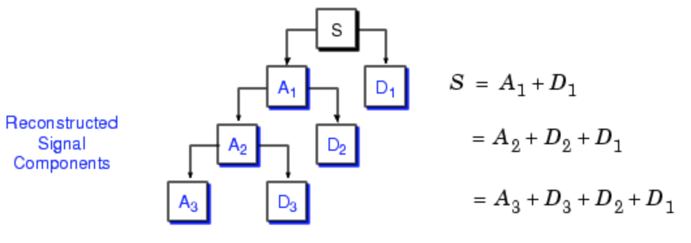

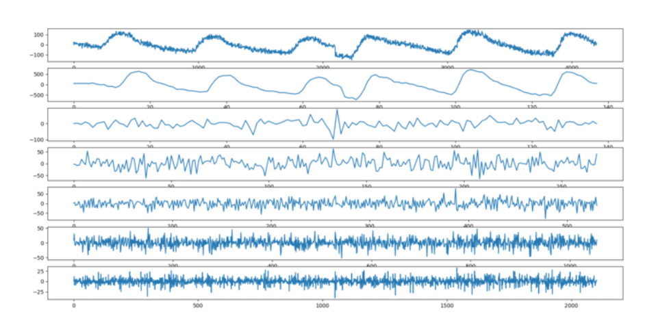

## Descrizione dell'algoritmo

L'algoritmo di event detection si basa sull'utilizzo di una trasformata
wavelet discreta non decimata (*modwt*, maximal overlap DWT).
L'obiettivo è quello di rendere maggiormente evidenti i complessi QRS
effettuando un **filtraggio passa-banda** del segnale che elimini da un
lato le basse frequenze (e quindi anche le onde P e T) e dall'altro le
alte frequenze (ovvero il rumore). Tale filtraggio passa-banda può
essere facilmente realizzato tramite la decomposizione wavelet andando
ad eliminare i coefficienti relativi alle scale più alte (bassa
frequenza) e alle scale più basse (alta frequenza) \[8\].

Utilizzando una trasformata non decimata, ad ogni livello di
decomposizione non si ha il sotto-campionamento.

La wavelet utilizzata per la decomposizione del segnale è la wavelet
sym4 (symlet 4) con 4 momenti evanescenti. Il motivo di questa scelta
risiede nel fatto che questa wavelet ha una **forma molto simile a
quella del QRS**, come visibile dal grafico riportato:

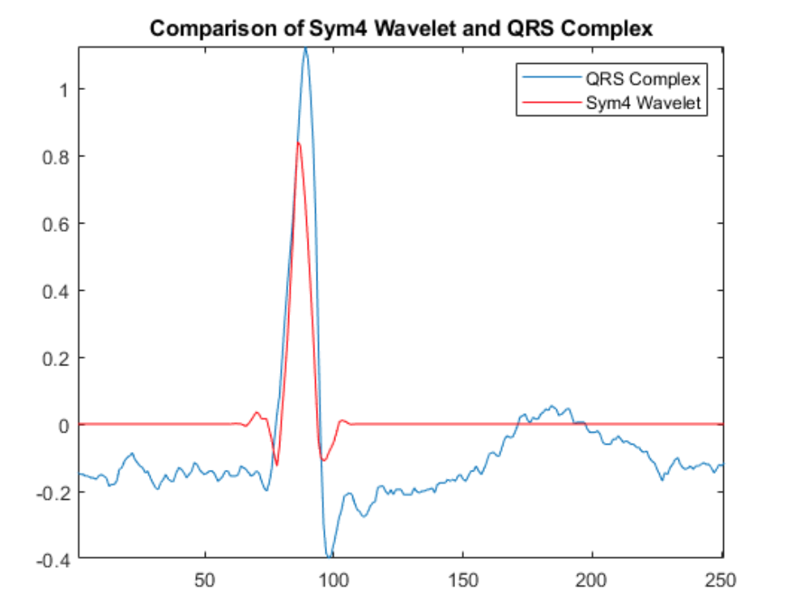

La trasformata wavelet permette come detto di scomporre il segnale in
sottobande. Il grafico mostra la decomposizione di un segmento di
segnale ECG in 7 livelli. Possiamo osservare come i coefficienti di
livello 3 e 4 siano quelli che riproducono meglio i complessi QRS.

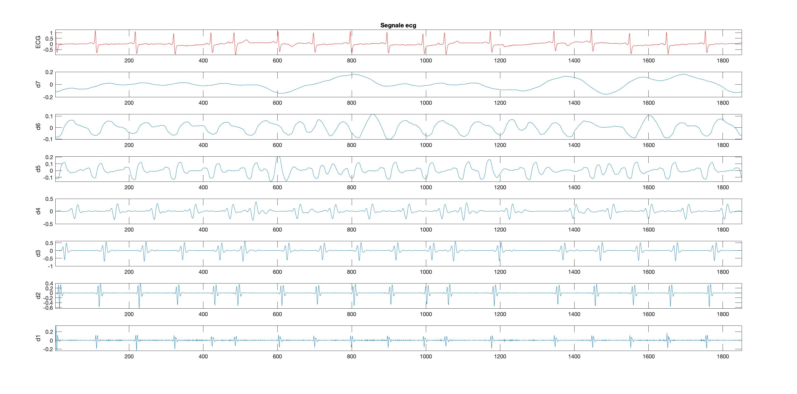

L'idea è quindi quella di ricostruire il segnale ECG utilizzando solo i
dettagli di questi livelli.

Il grafico mostra la ricostruzione del segnale ECG effettuata
rispettivamente con il solo livello 3, con il solo livello 4 e con i due
livelli 3 e 4.

{width="5.689627077865267in"
height="2.817050524934383in"}

### Passi algoritmici

I passi dell'algoritmo di rilevazione del complesso QRS basato sulla DWT
sono i seguenti:

1.  Si effettua la decomposizione del segnale fino al livello 4 usando
    la funzione *modwt* e la wavelet madre sym4;

2.  Si selezionano i livelli di dettaglio che rappresentano meglio i
    complessi QRS;

3.  Si ricostruisce il segnale con i soli livelli selezionati
    utilizzando la funzione *imodwt*;

4.  Si calcola il modulo al quadrato del segnale ricostruito;

5.  Si identifica un evento ogni qualvolta il modulo al quadrato del
    segnale ricostruito presenta un massimo locale superiore ad una
    certa soglia pari proporzionale al valor medio del segnale (la
    ricerca di massimo si effettua con *findpeaks*).

### Ottimizzazione

Abbiamo effettuato una simulazione relativamente alla traccia 118 usando
una ricostruzione del segnale ECG basata unicamente sui coefficienti di
livello 3 e ottimizzando la soglia. Costruendo le curve ROC e
identificando il punto che massimizza le performance si è trovato che la
soglia ottima è:

$$t_{h} = 2 \cdot average\ value$$

Con questa soglia si ottengono i seguenti valori di specificità,
sensibilità e accuratezza sulla traccia 118:

$$sens = 99,98\%$$

$$spec = 99,99\%$$

$$acc = 99,99\%$$

Abbiamo quindi ripetuto la stessa procedura anche per la ricostruzione
basata sui coefficienti di livello 4. In questo caso i risultati sono
decisamente meno buoni (la sensibilità non supera mai il 70%) quindi
abbiamo escluso questo metodo.

Abbiamo infine ripetuto gli stessi passi nel caso di ricostruzione con
coefficienti di livello 3 e 4. In questo caso le soglie migliori dalle
curve ROC risultano essere

$$t_{h_{1}} = 2 \cdot average\ value$$

$$t_{h_{2}} = 3 \cdot average\ value$$

I valori di sensibilità, specificità e accuratezza ottenuti con queste
soglie sulla traccia 118 sono rispettivamente:

$$\text{sen}s_{1} = 99,56\%\ \ \ \ \ \ \ sens_{2} = 99,53\%$$

$$\text{spe}c_{1} = 99,82\%\ \ \ \ \ \ spec_{2} = 99,92\%$$

$$\text{ac}c_{1} = 99,82\%\ \ \ \ \ acc_{2} = 99,92\%$$

Abbiamo quindi testato l'algoritmo con wavelet basato sulla
ricostruzione con i soli coefficienti di livello 3 su tutte le tracce
del dataset con la soglia ottimizzata. Il grafico a seguire riporta i
valori di sensibilità, specificità e accuratezza per ogni traccia:

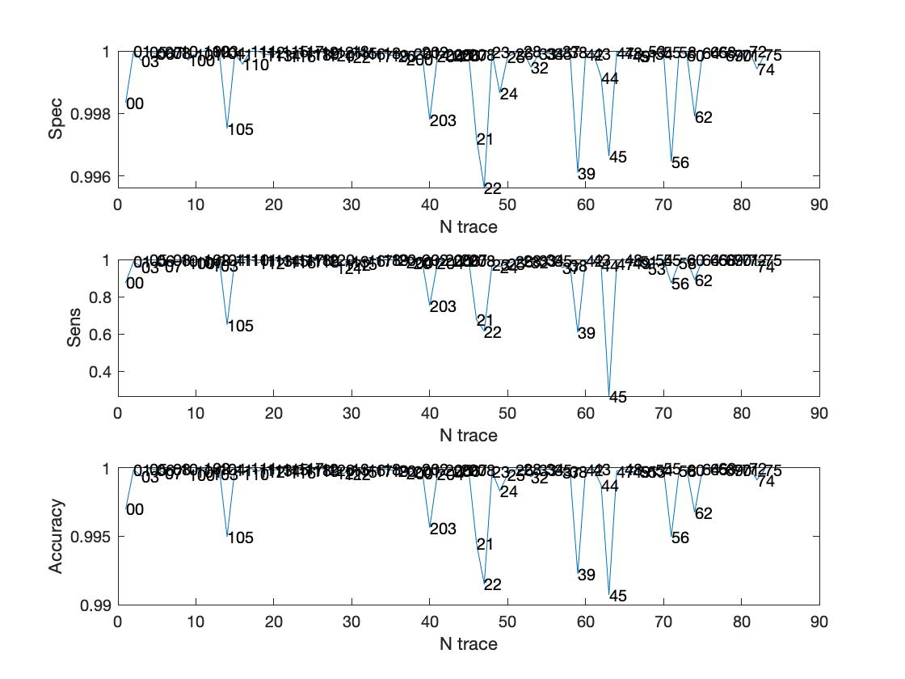{width="4.229377734033246in"
height="3.1720341207349083in"}

$$\text{Spe}c_{\text{average}} = 99,96\%$$

$$\text{Sen}s_{\text{average}} = 95,63\%$$

$$\text{Ac}c_{\text{average}} = 99,92\%$$

Stesse considerazioni sono state svolte anche nel caso della
ricostruzione con i coefficienti del livello 3 e 4.

Con la soglia $t_{h_{1}}$ si ottengono i seguenti risultati:

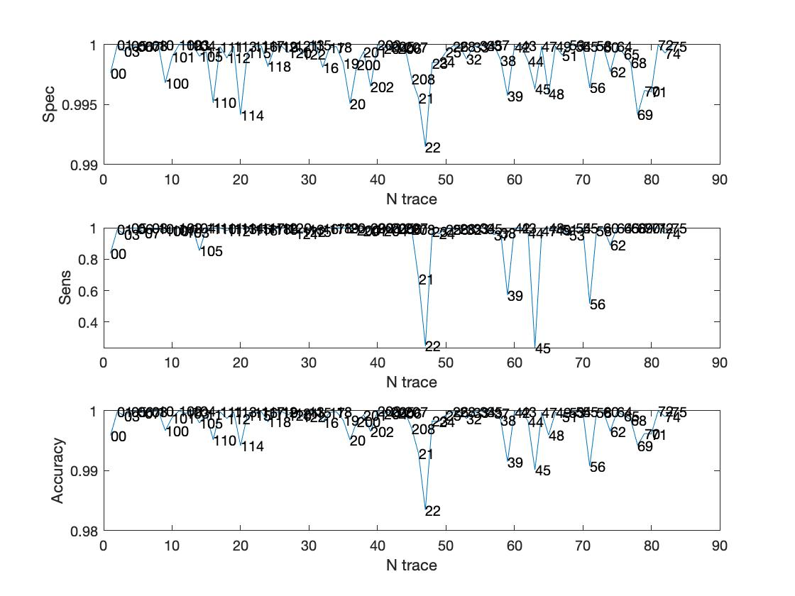{width="4.483146325459318in"
height="3.3623600174978128in"}

$$\text{Spe}{c_{1}}_{\text{average}} = 99,88\%$$

$$\text{Sen}{s_{1}}_{\text{average}} = 95,32\%$$

$$\text{Ac}{c_{1}}_{\text{average}} = 99,83\%$$

Con la soglia $t_{h_{2}}$ si ottengono invece i seguenti risultati:

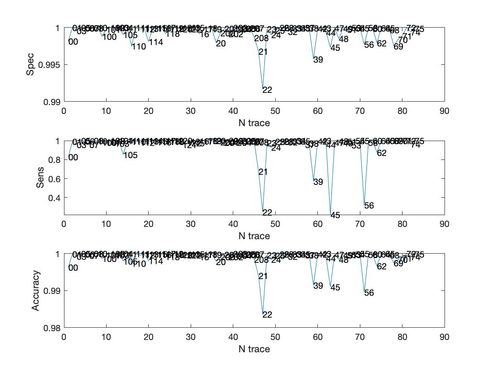{width="4.098147419072616in"
height="3.073611111111111in"}

$$\text{Spe}{c_{2}}_{\text{average}} = 99,94\%$$

$$\text{Sen}{s_{2}}_{\text{average}} = 94,88\%$$

$$\text{Ac}{c_{2}}_{\text{average}} = 99,89\%$$

+---------------------------+---------------------+-------------------+
| Ricostruzione con         | Ricostruzione con   |                   |
| coefficienti di livello 3 | coefficienti di     |                   |
|                           | livello 3-4         |                   |
+===========================+=====================+===================+
| $$\mathbf{t}_{\mathbf{h}  | $$\ma               | $$\mathbf{t       |
| }\mathbf{= 2 \cdot avg}$$ | thbf{t}_{\mathbf{h} | }_{\mathbf{h}_{\m |
|                           | _{\mathbf{1}}}\math | athbf{2}}}\mathbf |
|                           | bf{= 2 \cdot avg}$$ | {= 3 \cdot avg}$$ |
+---------------------------+---------------------+-------------------+
| $$                        | $$\text{Sp          | $$\text{Spe}{c    |
| \mathbf{\text{Spe}}\mathb | e}{c_{1}}_{\text{av | _{2}}_{\text{aver |
| f{c}_{\mathbf{\text{avera | erage}} = 99,88\%$$ | age}} = 99,94\%$$ |
| ge}}}\mathbf{= 99,96\%}$$ |                     |                   |
|                           | $$\text{Se          | $$\text{Sen}{s    |
| $$                        | n}{s_{1}}_{\text{av | _{2}}_{\text{aver |
| \mathbf{\text{Sen}}\mathb | erage}} = 95,32\%$$ | age}} = 94,88\%$$ |
| f{s}_{\mathbf{\text{avera |                     |                   |
| ge}}}\mathbf{= 95,63\%}$$ | $$\text{A           | $$\text{Ac}{c     |
|                           | c}{c_{1}}_{\text{av | _{2}}_{\text{aver |
| $                         | erage}} = 99,83\%$$ | age}} = 99,89\%$$ |
| $\mathbf{\text{Ac}}\mathb |                     |                   |
| f{c}_{\mathbf{\text{avera |                     |                   |
| ge}}}\mathbf{= 99,92\%}$$ |                     |                   |
+---------------------------+---------------------+-------------------+

Abbiamo quindi deciso di utilizzare la ricostruzione con soli
coefficienti di livello 3. Abbiamo quindi provato ad effettuare una
ottimizzazione della soglia a partire da un training set (tracce 22, 45,
39, 110, 111, 112, 113, 114, 115, 116). Risulta che la soglia ottima,
che massimizza le performance dell'algoritmo su tutte le tracce, è
$0.5 \cdot average$.

Con questa soglia si ottengono i seguenti risultati:

{width="6.515971128608924in"
height="3.22619094488189in"}

$$\text{Sen}s_{\text{average}} = 96,14\%$$

$$\text{Spe}c_{\text{average}} = 99,80\%$$

$$\text{Ac}c_{\text{average}} = 99,76\%$$

# Conclusioni

+-------------------+------------------+------------------------------+
| Algoritmo         | Performance      | Dettagli                     |
+===================+==================+==============================+
| QRS: Fraden       | $$\text{Se       | Sensibile agli artefatti da  |
| Newman            | n}s_{\text{avera | movimento                    |
|                   | ge}} = 92,48\%$$ |                              |
|                   |                  | Poco sensibile.              |
|                   | $$\text{Sp       |                              |
|                   | e}c_{\text{avera |                              |
|                   | ge}} = 98,16\%$$ |                              |
|                   |                  |                              |
|                   | $$\text{A        |                              |
|                   | c}c_{\text{avera |                              |
|                   | ge}} = 98,11\%$$ |                              |
+-------------------+------------------+------------------------------+
| QRS: Template con | $$\text{Se       | Template costruito a partire |
| norma L2          | n}s_{\text{avera | da una singola traccia.      |
|                   | ge}} = 94,17\%$$ | Performance peggiori su      |
|                   |                  | tracce con molti battiti     |
|                   | $$\text{Sp       | ventricolari.                |
|                   | e}c_{\text{avera |                              |
|                   | ge}} = 97,88\%$$ | Computazionalmente           |
|                   |                  | complesso.                   |
|                   | $$\text{A        |                              |
|                   | c}c_{\text{avera |                              |
|                   | ge}} = 97,85\%$$ |                              |
+-------------------+------------------+------------------------------+
| QRS: Template con | $$\text{Se       | Template costruito a partire |
| c                 | n}s_{\text{avera | da forme d'onda di tracce    |
| ross-correlazione | ge}} = 94,72\%$$ | diverse. Mostra performance  |
|                   |                  | ridotte su tracce con molti  |
|                   | $$\text{Sp       | battiti ventricolari.        |
|                   | e}c_{\text{avera | Computazionalmente           |
|                   | ge}} = 98,13\%$$ | complesso.                   |
|                   |                  |                              |
|                   | $$\text{A        |                              |
|                   | c}c_{\text{avera |                              |
|                   | ge}} = 98,10\%$$ |                              |
+-------------------+------------------+------------------------------+
| QRS: algoritmo    | $$\text{Se       | Più sensibile e veloce.      |
| con wavelet       | n}s_{\text{avera |                              |
|                   | ge}} = 96,14\%$$ | Complesso                    |
|                   |                  |                              |
|                   | $$\text{Sp       |                              |
|                   | e}c_{\text{avera |                              |
|                   | ge}} = 99,80\%$$ |                              |
|                   |                  |                              |
|                   | $$\text{A        |                              |
|                   | c}c_{\text{avera |                              |
|                   | ge}} = 99,76\%$$ |                              |
+-------------------+------------------+------------------------------+

# Fibrillazione atriale

## Cos'è e come si manifesta

La fibrillazione atriale è **l\'aritmia cardiaca** più diffusa nella
popolazione generale e la sua prevalenza tende a crescere con
l\'aumentare dell\'età. Più di 6 milioni di persone in Europa presentano
questa forma di aritmia e si prevede che la sua prevalenza raddoppierà
nel 2050. In Italia secondo uno studio condotto nel 2010, le persone
affette da FA sono circa 600 mila. Pur non essendo un\'aritmia di per sé
pericolosa per la vita, può esporre a delle complicanze che, in alcuni
casi, possono rivelarsi molto invalidanti.

Si tratta di un\'aritmia cardiaca sopra-ventricolare innescata da
impulsi elettrici provenienti da cellule muscolari miocardiche presenti
a livello della giunzione tra le quattro vene polmonari e l\'atrio
sinistro.\
Nella fibrillazione atriale l\'attività elettrica degli atri è
completamente caotica e non coordinata con l'attività ventricolare per
cui non corrisponde a un\'attività meccanica efficace.

La fibrillazione atriale colpisce lo 0,5 -1% della popolazione generale
con una prevalenza che aumenta con l\'età (0,1% sotto i 55 anni, 8-10%
oltre gli 80). La maggior parte dei pazienti affetti ha quindi più di 65
anni; gli uomini sono generalmente più colpiti rispetto alle donne come
evidenziato dallo studio di Rotterdam (1990-1993).

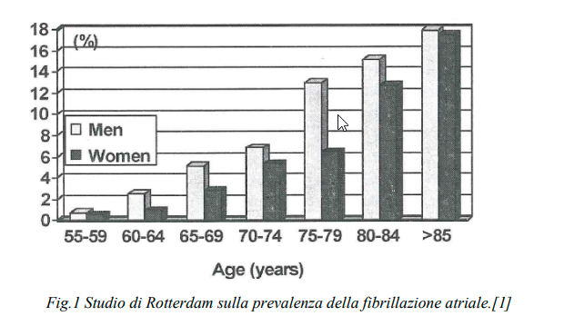{width="3.3319411636045495in"
height="1.8672747156605425in"}

In condizioni normali, l'impulso viene generato spontaneamente nel nodo
seno-atriale (pacemaker naturale), situato nella parte anteriore della
giunzione tra atrio destro e vena cava superiore. L'impulso attraversa
le vie internodali e arriva al nodo atrio-ventricolare, il quale
rallenta la conduzione elettrica per far contrarre sequenzialmente atri
e ventricoli, successivamente passa al fascio di His, da cui si diramano
due branche (dx e sx) che trasmettono l'impulso ai ventricoli attraverso
le fibre del Purkinje.

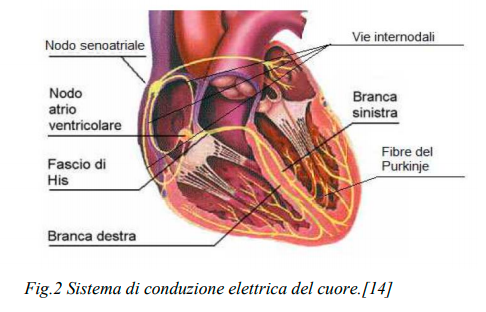{width="3.100650699912511in"
height="1.9895833333333333in"}

Il nodo seno-atriale (SA) però non è l'unica sede di insorgenza del
ritmo. Infatti, in condizioni fisiologiche, tutte le cellule del sistema
di conduzione potrebbero generare l'impulso elettrico ad una propria
frequenza, ed il fatto che fisiologicamente il pacemaker sia
rappresentato dal SA è legato esclusivamente alla sua maggiore frequenza
di scarica che impedisce alle altre cellule del sistema di conduzione di
generare autonomamente il battito cardiaco. In stato di FA, il nodo
seno-atriale perde il controllo dell'attività cardiaca e l'attività
elettrica necessaria alla contrazione viene originata in vari siti
nell'atrio, prevalentemente vicino alle vene polmonari. Questo disordine
porta alla contrazione contemporanea di singoli gruppi di cellule
cardiache, detti "focolai ectopici", causando la perdita della funzione
contrattile atriale e la comparsa di una frequenza cardiaca irregolare.

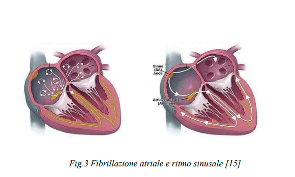{width="3.48128280839895in"
height="1.7025054680664917in"}

La FA può essere classificata come un tipo di tachicardia,
caratterizzata da un numero di impulsi al minuto compreso tra i 450 e i
600 e, dallo scatenarsi di questi impulsi, alcune zone dell'atrio si
contraggono simultaneamente, altre sono in stato di rilassamento. In tal
modo non si genererà mai una contrazione simultanea degli atri
compromettendo la loro funzione di pompa di innesco per i ventricoli.
Fortunatamente, il nodo atrio-ventricolare (AV) lascia entrare nel
fascio di His e nei ventricoli 150-180 impulsi al massimo, anche in
condizioni di FA, permettendo al cuore di continuare a svolgere la sua
funzione di pompa, riempiendosi e svuotandosi. La fibrillazione atriale,
quindi, accelera la funzionalità cardiaca riducendo al 20-30% la sua
efficienza e come altre aritmie riduce la gittata cardiaca e l'apporto
di ossigeno necessario all'organismo. I meccanismi che influenzano
l'insorgere della patologia possono essere dovuti a fattori cardiaci
(ipertensione arteriosa, insufficienza cardiaca, patologie coronariche,
esiti di chirurgia cardiaca) o a fattori non legati al cuore (obesità,
patologie polmonari, diabete mellito).

{width="4.5641021434820646in"
height="1.9302351268591427in"}

In alcuni casi si presenta in assenza di apparenti condizioni favorenti,
ossia in assenza di una cardiopatia strutturale o di condizioni
sistemiche (come l\'ipertiroidismo) che la possano determinare. Si parla
quindi di **fibrillazione isolata** e rappresenta in genere meno del 30%
dei casi.

Dal punto di vista clinico la fibrillazione atriale si suddivide in base
al modo di presentazione e alla durata dell'aritmia in (Linee Guida 2012
ESC, European Society of Cardiology):

-   **parossistica**: quando gli episodi si presentano e si risolvono
    spontaneamente in un tempo inferiore a una settimana;

-   **persistente**: quando l\'episodio aritmico dura più di 7 giorni e
    non si interrompe spontaneamente ma solo a seguito di interventi
    terapeutici esterni (farmacologici o elettrici);

-   **permanente**: quando non siano ritenuti opportuni tentativi di
    cardioversione, o gli interventi terapeutici si siano dimostrati
    inefficaci. In tal caso, si decide di non cercare più di
    ripristinare il ritmo sinusale;

-   **asintomatica**: quando essa si presenta in modo silente ovvero non
    dando al paziente dei sintomi rilevabili per cui non viene
    diagnosticata.

Più spesso, la fibrillazione atriale è associata a **sintomi**; i più
frequenti sono: palpitazioni (dovute all'irregolarità del battito),
debolezza o affaticabilità (per via della ridotta gittata cardiaca),
raramente sincope, dolore toracico. In alcuni casi è asintomatica o se
sono presenti sintomi non vengono riconosciuti dal paziente, che si
limita ad adeguare il proprio stile di vita. Un esempio è la riduzione
della tolleranza allo sforzo. Oltre ai sintomi, talvolta invalidanti, la
fibrillazione atriale mette a rischio di **eventi trombotici**, poiché
l\'immobilità meccanica degli atrii favorisce la formazione di coaguli
che possono in seguito migrare nel circolo cerebrale e provocare
ischemie e ictus cerebrale.

La mortalità cardiovascolare è aumentata nei soggetti interessati da
fibrillazione atriale e la qualità della vita è ridotta. Inoltre, la
persistenza della fibrillazione atriale determina un **rimodernamento
degli atrii**, che assumono caratteristiche elettriche, anatomiche e
strutturali (dilatazione, fibrosi) tali da favorire il perpetuarsi
dell\'aritmia.

Diagnosticare una condizione di fibrillazione atriale è importante anche
se spesso risulta difficile, sia perché i sintomi non sono sempre
evidenti, sia perché la FA è un evento imprevedibile. Uno degli
strumenti maggiormente utilizzati per riconoscere questa forma di
aritmia è l'utilizzo del tracciato elettrocardiografico. Gli **aspetti**
elettrocardiograficamente **salienti** della **fibrillazione atriale**
sono:

-   l'**assenza di una onda P** (onda di attivazione atriale) vera e
    propria, che è sostituita dalle onde di fibrillazione dette onde f,
    di forma, durata e frequenza irregolare. Di fatto, l'onda P viene
    sostituita da una linea irregolare associata all'assenza di
    contrazione dovuta all'attività atriale disorganizzata;

-   l\'**irregolarità degli intervalli RR** dovuta al fatto che un
    grande numero di impulsi raggiunge il nodo atrio-ventricolare e il
    numero di impulsi che vengono lasciati passare per raggiungere i
    ventricoli dipende dalle caratteristiche elettrofisiologiche del
    nodo AV ma anche dalle altre porzioni del sistema di conduzione, dal
    tono del sistema nervoso autonomo ecc. Tutte queste variabili
    contribuiscono alla variazione di durata degli intervalli RR. I
    complessi QRS sono normali perché la conduzione nei ventricoli e
    verso i ventricoli segue il percorso normale.

{width="4.416666666666667in"
height="1.8034722222222221in"}

Se gli episodi si presentano ad intermittenza è necessario utilizzare un
dispositivo di monitoraggio (holter) per un certo periodo di tempo, che
registra continuamente l'attività del cuore.

Esistono diverse **strategie cliniche** per trattare la fibrillazione
atriale e una di queste è la terapia farmacologica. I farmaci utilizzati
in quest'ultimo caso agiscono sui canali del potassio, bloccandoli e
cercando di allungare il potenziale d'azione in maniera tale da
aumentare il periodo refrattario delle fibre cardiache e impedendo la
generazione di un altro battito a breve distanza temporale.

Infine, un'altra terapia è l'ablazione trans catetere, procedura non
chirurgica che prevede la cauterizzazione di alcune zone del tessuto
cardiaco attraverso l'utilizzo di un catetere.

## Descrizione dell'algoritmo di rilevazione della fibrillazione atriale

Abbiamo implementato un algoritmo basato sul paper \[1\]. Questo
algoritmo sfrutta la rapida e irregolare attività elettrica che
caratterizza la fibrillazione atriale, la quale produce un incremento
sia nella variabilità che nella complessità degli intervalli RR.

Proprio a partire da queste caratteristiche di variabilità e
complessità, l'algoritmo combina due metodi, diagramma di Poincaré e la
sample entropy, per quantificare rispettivamente la variabilità e la
complessità degli intervalli RR.

### Plot di Poincaré

Un diagramma di Poincaré è un diagramma di ricorrenza che viene usato
per quantificare l'auto-similarità nei processi. Il ritmo di un cuore
sano è normalmente controllato in modo molto rigoroso dai meccanismi
regolatori del corpo. Il digramma di Poincaré può essere usato per
visualizzare e rilevare la presenza di oscillazioni nell'azione cardiaca
legata a malattie o anomalie del cuore, come nel caso della
fibrillazione atriale. \[6\] \[7\]

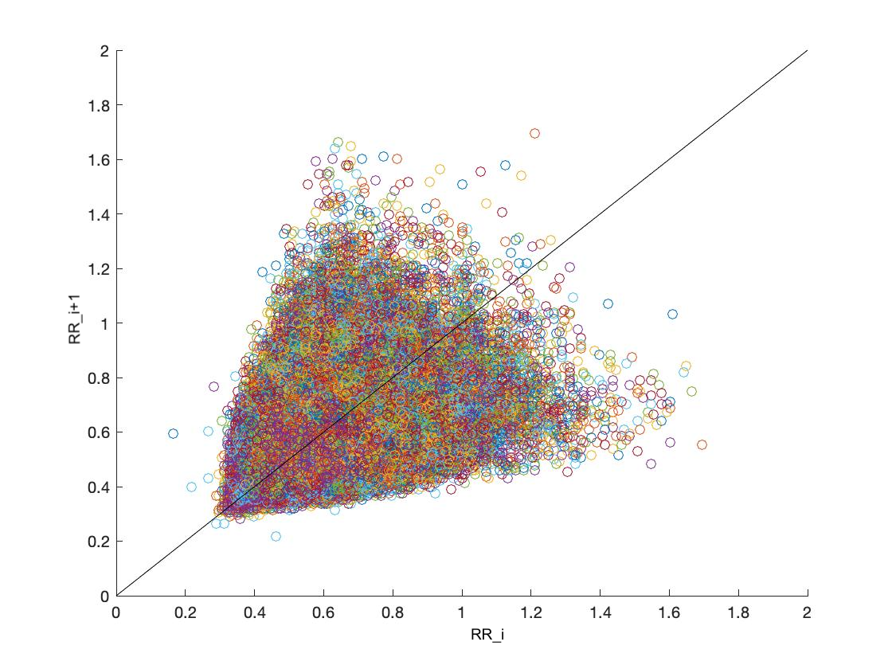{width="3.0678762029746283in"
height="2.3009076990376203in"}
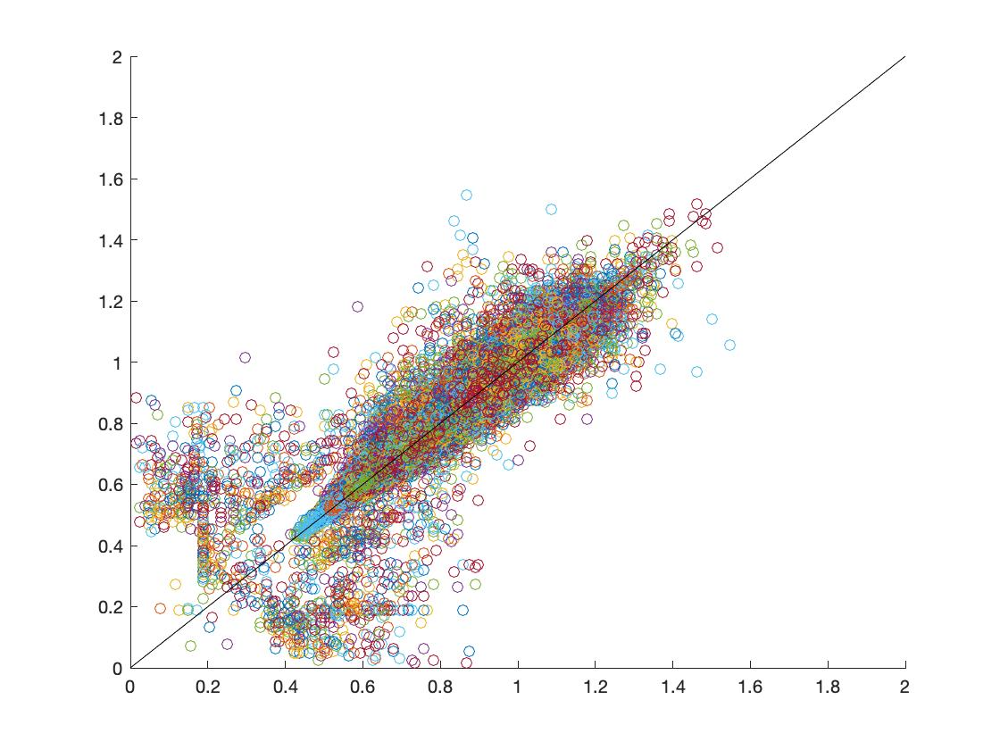{width="3.2522790901137357in"
height="2.439209317585302in"}

I precedenti grafici sono diagrammi di Poincaré relativi al cuore con
fibrillazione atriale (sinistra) e quello senza fibrillazione atriale
(destra). La differenza nella forma tra i due casi è chiaramente
visibile.

Il diagramma di Poincaré viene costruito esprimendo ciascun intervallo
RR in funzione del precedente. Di fatto, si riportano gli $RR_{i}$
sull'asse delle ascisse e gli $RR_{i + 1}$ su quello delle ordinate.
Tutti i punti descritti da battiti cardiaci consecutivi di uguale durata
$RR_{i} = RR_{i + 1}$ sono posizionati sulla bisettrice. I punti che
rappresentano intervalli RR sopra la bisettrice corrispondono a dei
prolungamenti $RR_{i} < RR_{i + 1}$ mentre tutti quelli che si trovano
al di sotto corrispondono ad un accorciamento della durata di due
battiti successivi $RR_{i} > RR_{i + 1}$. \[2\] \[5\]

Il plot di Poincaré è normalmente caratterizzato da due descrittori,
$SD1$ e $SD2$:

-   $SD1$ rappresenta la dispersione rispetto alla bisettrice e
    identifica la variabilità della frequenza cardiaca a breve termine
    (variabilità istantanea battito per battito). Per calcolarla, i
    punti del plot vengono proiettati su una linea perpendicolare alla
    bisettrice e se ne calcola la deviazione standard;

-   $SD2$ rappresenta la dispersione rispetto ad un asse perpendicolare
    alla bisettrice. Esso quantifica la variabilità a lungo termine. Per
    calcolarla, i punti del plot sono proiettati su una linea parallela
    alla bisettrice e se ne calcola la deviazione standard.

Nello specifico,

$$x = \lbrack RR_{1},\ RR_{2},\ \ldots,\ RR_{N - 1}\rbrack$$

$$y = \lbrack RR_{2},\ RR_{3},\ \ldots,\ RR_{N}\rbrack$$

$$x_{1} = \frac{x - y}{\sqrt{2}}\text{\ \ \ \ \ \ }x_{2} = \frac{x + y}{\sqrt{2}}$$

$$SD1 = \sqrt{{var(x}_{1})}$$

$$SD2 = \sqrt{var(x_{2})}$$

Una volta calcolati questi parametri si va a determinare l'area
dell'ellisse che riflette la variabilità totale degli intervalli RR:

$$S = \pi \cdot SD1 \cdot SD2$$

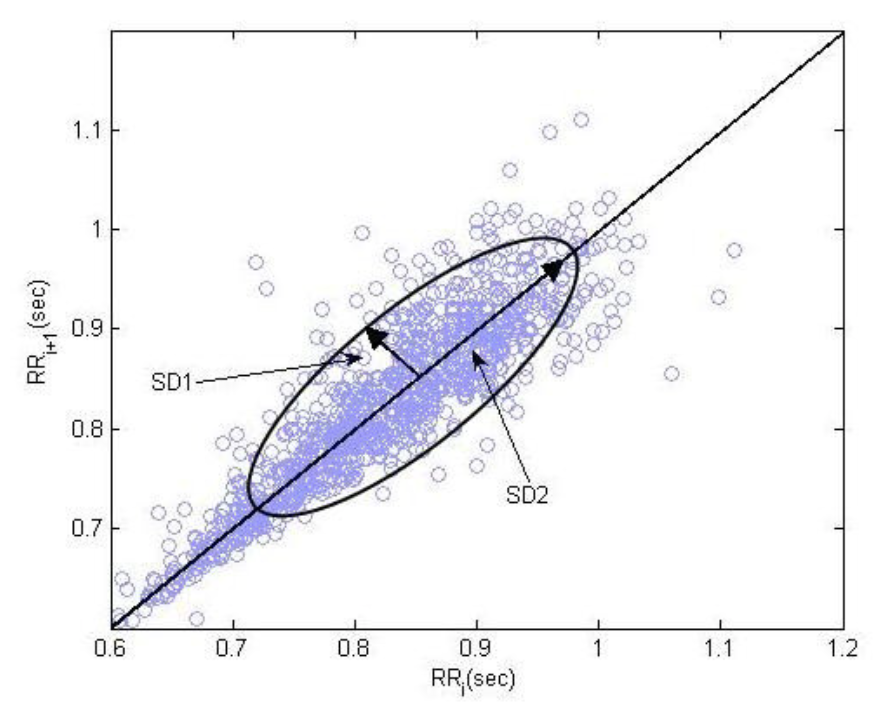{width="3.577929790026247in"
height="2.9096150481189853in"}

### Sample Entropy

La sample entropy è utilizzata per stimare la complessità di serie
temporali. Nell'algoritmo viene utilizzata per caratterizzare la
complessità degli intervalli RR.

Per una data embedding dimension $m$, tolleranza $r$ e un numero di
punti $N$, la sample entropy è il logaritmo naturale cambiato di segno
della probabilità che se due set di punti simultanei di lunghezza $m$
hanno distanza minore di $r$, anche due set di punti simultanei di
lunghezza $m + 1$ hanno distanza minore di $r$.

Più nel dettaglio, si considera una serie temporali di dati di lunghezza
$N$ con un intervallo di tempo costante $\tau$:

$$N = \{ x_{1},\ x_{2},\ \ldots,\ x_{N}\}$$

Si costruiscono $i = 1,\ldots,\ N - m + 1$ vettori di lunghezza $m$:

$$RR_{m}(i) = \left\lbrack RR_{i}\ R_{i + 1}\ldots RR_{i + m - 1} \right\rbrack$$

Si calcola la probabilità che ognuno di questi vettori sia simile a
$RR_{m}(i)$:

$$C_{i}(m,r) = \frac{n_{i}(m,r)}{N - m + 1}$$

Con:

-   $r$ la tolleranza sulla similarità tra due vettori;

-   $n_{i}(m,r)$ è il numero di vettori $RR_{m}(j)$ che sono simili a
    $RR_{m}(i)$ con $i \neq j$, ovvero tale per cui vale la relazione:

$$d\left( RR_{m}(i),\ RR_{m}(j) \right) = \max\left( \left| RR_{i + k} - RR_{j + k} \right| \right) < r\ \ \ con\ \ \ k = 0,\ \ldots,\ m - 1\ \ $$

Si va quindi a calcolare la probabilità media:

$$A(m,r) = \frac{1}{N - m + 1}\sum_{i = 1}^{N - m + 1}{C_{i}(m,r})$$

Si ripete lo stesso procedimento anche per $m + 1$ ottenendo la
probabilità media $B(m + 1,r)$. Si va quindi a calcolare la sample
entropy come:

$$\text{SampleEntropy}(RR,m,r) = - \ln\frac{B(m + 1,r)}{A(m,r)}$$

Di fatto, $A$ è il numero di coppie di vettori per i quali
$d\left\lbrack RR_{m}(i),RR_{m}(j) \right\rbrack < r$ mentre $B$ è il
numero di coppie per le quali
$d\left\lbrack RR_{m + 1}(i),RR_{m + 1}(j) \right\rbrack < r$.

Un valore basso di sample entropy indica la presenza di una certa
auto-similarità nel dataset.

In generale, il valore di $m$ è scelto pari a $2$ e quello della
tolleranza $r$ pari a $0.2 \cdot std$.

### Passi dell'algoritmo

I passi dell'algoritmo di riconoscimento della fibrillazione atriale
sono i seguenti:

1.  per ogni traccia si calcolano gli intervalli $\text{RR}$ a partire
    dalle annotazioni del medico. Questa scelta è dettata dalla volontà
    di osservare i risultati di questo algoritmo senza l'interferenza
    relativa alla bontà dell'algoritmo di riconoscimento del QRS;

2.  una volta calcolati gli intervalli $\text{RR}$ si suddivide la serie
    temporale in segmenti non sovrapposti di $L$ intervalli ciascuno;

3.  in ciascuno di questi segmenti si va a calcolare il parametro $S$
    (funzione *poincarePlot*) legato alla variabilità totale degli
    intervalli e la sample entropy (*sampleEntropy*) legata alla
    complessità degli intervalli;

$${\text{if}(S > thS)\&(SampleEntropy > thE)
}{\text{is\ AFIB}
}{\text{else}
}\text{is\ ~NOT\ AFIB}$$

La classificazione sui segmenti di $L$ intervalli $\text{RR}$ è stata
poi convertita in una classificazione battito per battito tramite la
funzione *afibContingency*.

Il grafico riporta i valori di sensibilità, specificità e accuratezza
dell'algoritmo con le soglie consigliate dal paper ovvero $thS = 0.01$ e
$thE = 1.2$.

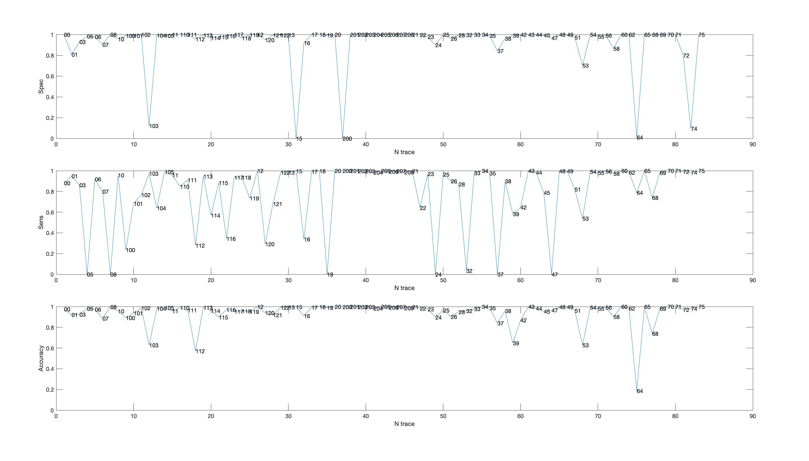{width="5.736842738407699in"
height="3.544808617672791in"}

$$\text{Sen}s_{\text{average}} = 79,76\%$$

$\text{Spe}c_{\text{average}} = 91,95\%$

$$\text{Ac}c_{\text{average}} = 93,95\%$$

La traccia 30, di durata di circa 6 ore, non presenta fibrillazione
atriale. In questo caso l'algoritmo classifica correttamente il paziente
come non malato:

$$TP = 0$$

$$TN = 31190$$

$$FP = 0$$

$$FN = 0$$

La traccia 17 presenta 24 ore e 55 minuti di fibrillazione atriale
(tutti i battiti sono fibrillazione atriale). In questo caso l'algoritmo
identifica:

$$TP = 136960$$

$$TN = 0$$

$$FP = 0$$

$$FN = 1100$$

La traccia 18 presenta 24 ore e 59 minuti di fibrillazione atriale
(tutti i battiti sono fibrillazione atriale). In questo caso l'algoritmo
identifica:

$$TP = 141312$$

$$TN = 0$$

$$FP = 0$$

$$FN = 201$$

Si è provato ad effettuare una ottimizzazione utilizzando un training
set. Le tracce del training set sono le seguenti (00, 01, 03, 05, 06,
07, 08, 10, 100, 101, 102, 103, 104, 105, 11, 110, 111, 112, 113, 114,
115, 116, 117, 118, 119, 12, 120, 121, 122, 15, 16, 17, 18, 19, 20, 200,
201, 202, 203, 204, 205, 206, 207, 208, 21, 22, 23, 24, 25, 26, 28, 32,
33, 34). Abbiamo di nuovo tracciato le curve ROC e ottenuto i seguenti
valori ottimi per le soglie:

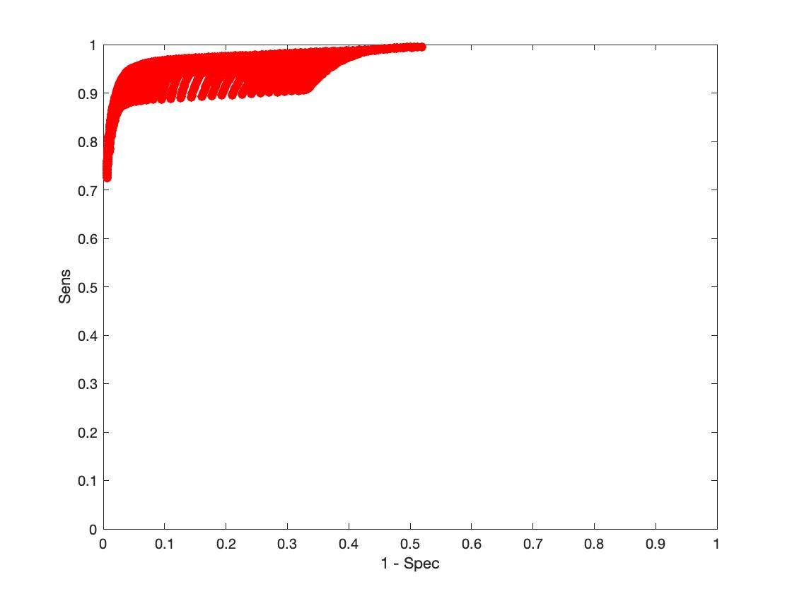

$$thS = 0.0085$$

$$thE = 1.22$$

Si osserva un minimo miglioramento rispetto al caso delle soglie del
paper, come mostrato dai grafici:

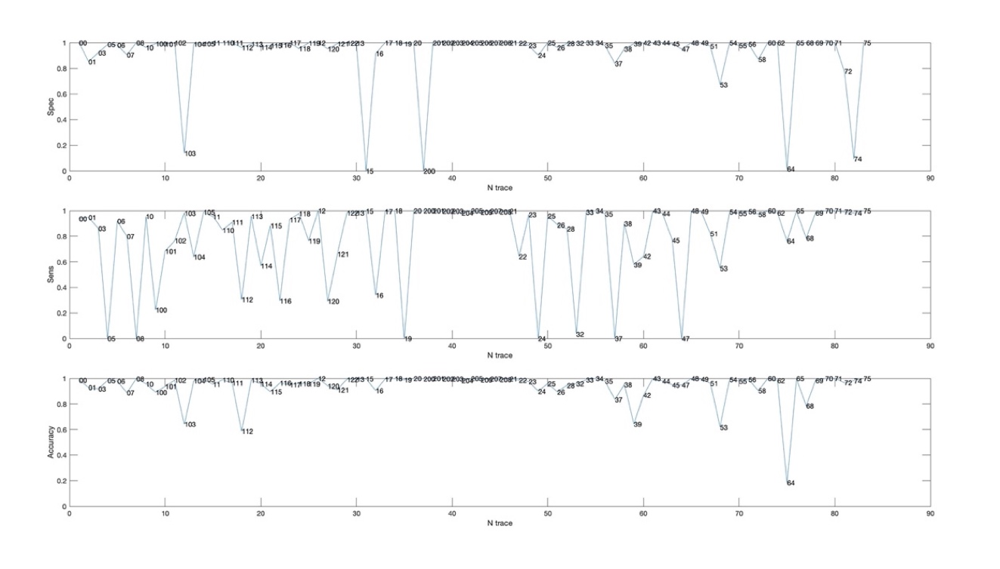{width="5.979861111111111in"
height="3.1457272528433946in"}

$$\text{Sen}s_{\text{average}} = 79,87\%$$

$$\text{Spe}c_{\text{average}} = 91,91\%$$

$$\text{Ac}c_{\text{average}} = 93,98\%$$

Il grafico mostra i risultati relativi all'applicazione dell'algoritmo
di fibrillazione atriale sulle tracce ECG del database *MIT-BIH normal
sinus rhythm database* relative a cuori normali. I valori di specificità
ottenuti non sono altissimi pertanto c'è un numero non trascurabile di
falsi positivi. Abbiamo comunque ritenuto che l'algoritmo fosse valido
soprattutto in vista di una eventuale revisione da parte del medico.

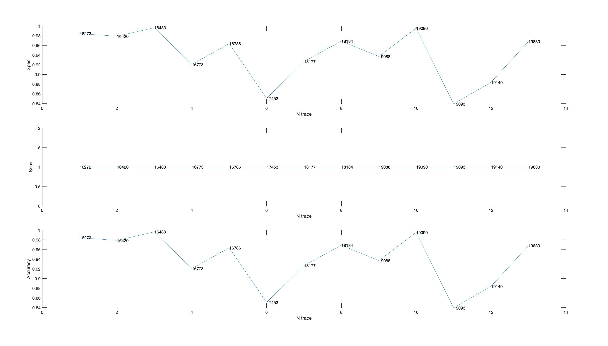{width="6.261395450568679in"
height="1.2266666666666666in"}

{width="6.261395450568679in"
height="1.2368055555555555in"}

$$\text{Spe}c_{\text{average}} = 93,95\%$$

Si riportano i risultati relativi all'applicazione dell'algoritmo sulla
traccia 00. In rosso sono riportate le annotazioni relative al nostro
algoritmo mentre quelle in verde sono quelle del gold standard (tali
annotazioni si riferiscono a intervalli in cui si manifesta la
fibrillazione atriale, ottenute collegando con una linea il primo e
l'ultimo battito di fibrillazione atriale):

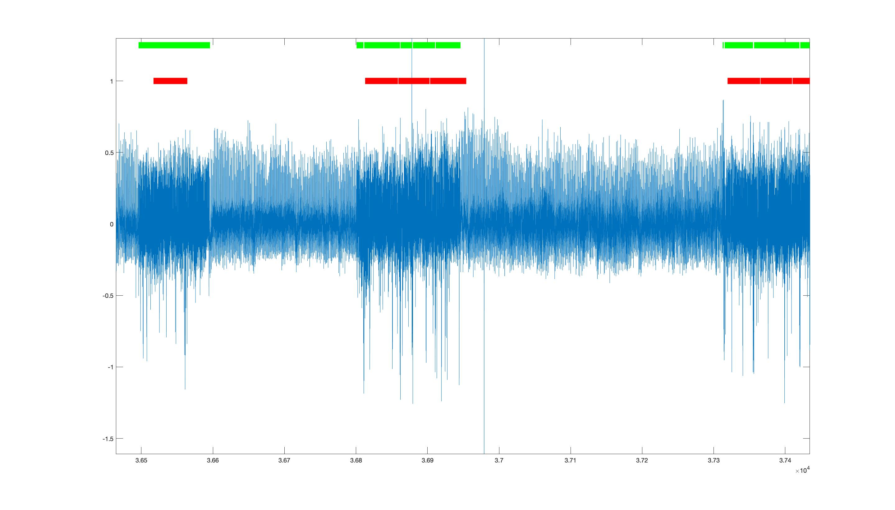

### Alcune osservazioni sui risultati ottenuti

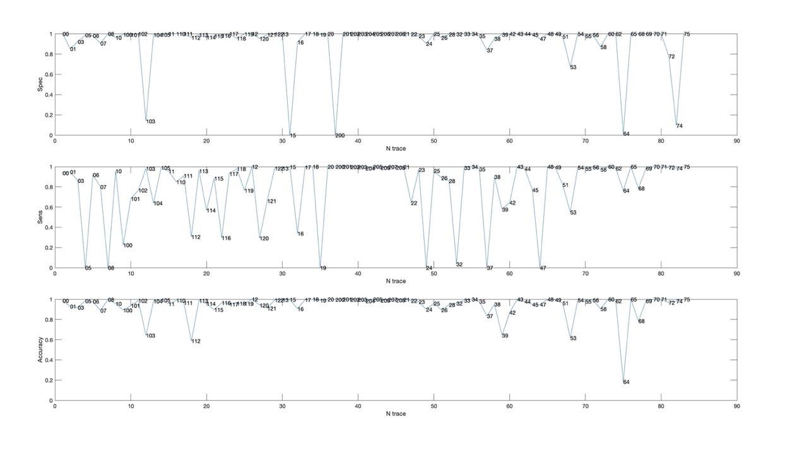

Come visibile dal grafico relativo all'accuratezza, sensibilità e
specificità dell'algoritmo su tutte le tracce con i valori ottimizzati
delle soglie, la specificità risulta molto bassa, se non addirittura
nulla per alcune tracce. In particolare, in alcune delle tracce in cui
questo si verifica (15, 200, 74), il numero di $\text{TN}$ è molto basso
perché le tracce manifestano per quasi la loro totalità fibrillazione
atriale. Nella traccia 103, invece, la ragione della bassa specificità è
legata ad un elevato numero di falsi positivi.

Si osserva che alcune tracce presentano valori molto bassi di
sensibilità. In alcune tracce, la fibrillazione atriale ha una durata
inferiore ai 3 minuti per cui il numero di $\text{TP}$ è molto molto
piccolo. Ne fanno parte, la traccia 05, 08, 24, 37, 47.

Il problema è anche legato al fatto che per come è pensato l'algoritmo
il comportamento ottimale si ha per segmenti di $L = 128$ intervalli RR
(non è riducibile perché la tolleranza $r$ sulla sample entropy è
proporzionale alla deviazione standard nel segmento). Questo comporta
l'impossibilità di discriminare eventi fibrillatori di durata troppo
inferiore alla finestra.

Abbiamo quindi in generale osservato che se nella traccia gli eventi
fibrillatori sono di durata molto breve e sono molto sparsi all'interno
delle 24 ore l'algoritmo è fallimentare anche se sono molti.

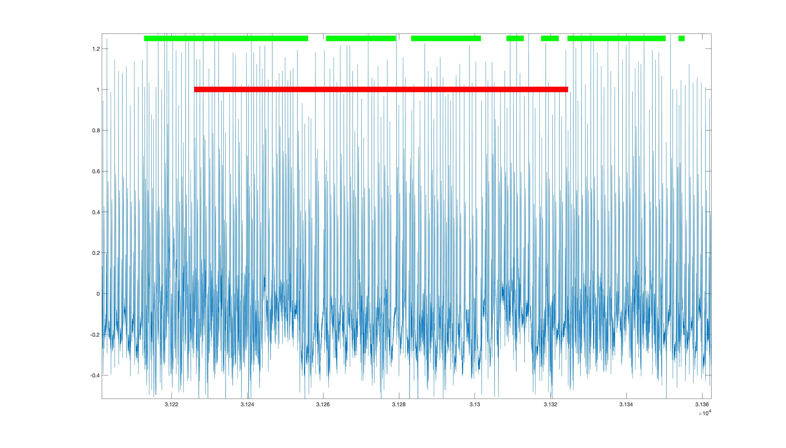

Il grafico è relativo alla traccia 100. In rosso le annotazioni del
nostro algoritmo, in verde quelle del gold standard. È esemplificativo
della problematica della finestra. La prima parte del tracciato non
viene riconosciuta come AFIB perché i battiti di fibrillazione rientrano
nella finestra precedente che contiene per la maggior parte battiti
normali. Stesse considerazioni sono valide per la parte finale del
tracciato. D'altro canto, la porzione di tracciato rilevata come AFIB
non riesce a tenere conto dei brevi intervalli di tempo in cui i battiti
ritornano normali perché nella finestra i battiti sono per la maggior
parte fibrillatori.

Possiamo quindi asserire che la scarsa sensibilità dell'algoritmo può
essere messa in relazione alla sua natura di classificazione in
segmenti: la classificazione viene infatti eseguita su un intervallo di
battiti e non sul singolo battito.

#### Osservazioni sull'algoritmo di contingenza della fibrillazione atriale

Per alcune tracce in cui vi erano solo battiti di fibrillazione atriale
$TN = 0,\ \ FP = 0$ oppure nel caso in cui la traccia presentava solo
battiti normali $TP = 0,\ \ FN = 0$, l'algoritmo di contingenza forniva
una indicazione NaN rispettivamente per specificità e sensibilità. Il
caso è stato previsto come classificazione corretta del soggetto.

# Bibliografia

\[1\] R. Mabrouki \"Atrial Fibrillation detection on
electrocardiogram,\" 2016 2nd International Conference on Advanced
Technologies for Signal and Image Processing (ATSIP), 2016, pp. 268-272,
doi: 10.1109/ATSIP.2016.7523112.

\[2\] Guzik P, Piskorski J, Krauze T, Wykretowicz A, Wysocki H. Heart
rate asymmetry by Poincaré plots of RR intervals. Biomed Tech (Berl).
2006 Oct;51(4):272-5. doi: 10.1515/BMT.2006.054. PMID: 17061956.

\[3\]
https://it.mathworks.com/matlabcentral/answers/161223-how-to-remove-transient-effect-in-the-beginning-of-the-filtered-signal

\[4\] Linee Guida 2012 ESC europea society of cardiology

\[5\] Piskorski, Guzik, Geometry of the Poincare plot of RR intervals
and its asymmetry in healthy adult Institute of Physics, University of
Zielona Gora, Prof. Szafrana 4a, 65-516

\[6\] "Poincaré Graph, complete ECG record in one sight", BTL
cardiopoint

\[7\] Do existing measures of Poincare plot geometry reflect nonlinear
features of heart rate variability?, [M.
Brennan](https://ieeexplore.ieee.org/author/38556221600); [M.
Palaniswami](https://ieeexplore.ieee.org/author/38320621600); [P.
Kamen](https://ieeexplore.ieee.org/author/38556109400)

\[8\]
https://it.mathworks.com/help/wavelet/ug/wavelet-analysis-of-physiologic-signals.html
